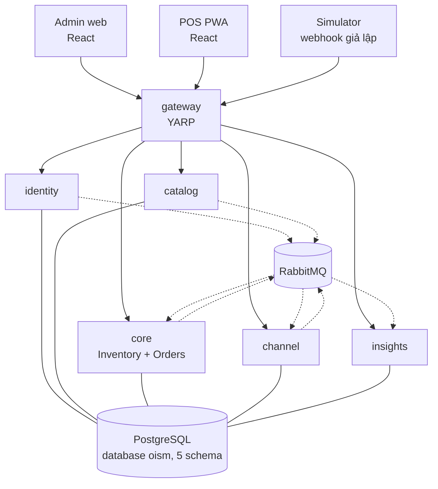

# OISM: Hệ thống quản lý bán hàng và tồn kho đa kênh

OISM (Omnichannel Inventory and Sales Management System) là hệ thống SaaS multi-tenant giúp cửa hàng bán lẻ quản lý đơn hàng và tồn kho trên nhiều kênh cùng lúc: quầy POS và các sàn Shopee, TikTok Shop, Lazada.

## Bài toán

Bán trên nhiều kênh rời nhau gây ra ba lỗi quen thuộc: bán vượt tồn vì đồng bộ chậm, giá vốn hàng bán (COGS) sai, và số liệu lệch vì sửa tồn bằng tay.

## Cách giải quyết

- **Sổ kho chỉ thêm mới.** Mọi thay đổi tồn là một dòng trong `inventory_transactions`; không sửa thẳng cột tồn, sửa sai bằng dòng đảo.
- **Chống bán vượt.** `available = on_hand - reserved`; đơn online vào là giữ hàng, khóa dòng số dư bằng `SELECT ... FOR UPDATE`. Đích: 50 đơn tranh 1 sản phẩm thì đúng 1 đơn thắng, tồn không âm.
- **Giá vốn bình quân gia quyền.** Tính lại khi xác nhận phiếu nhập; chốt vào dòng đơn lúc xác nhận và không đổi nữa.
- **Order hub.** Đơn từ POS, admin và webhook giả lập của sàn được chuẩn hóa về một Canonical Order, đi theo máy trạng thái Draft → Reserved → Confirmed → Completed (hoặc Cancelled).
- **POS PWA.** Thanh toán tại quầy chạy giữ hàng, xác nhận, trừ tồn trong một transaction.
- **Cách ly tenant.** Mọi bảng nghiệp vụ có `TenantId`, lọc bằng EF Core Global Query Filter.

## Chức năng

| Nhóm | Nội dung |
| --- | --- |
| FR-AUTH | Đăng ký tenant, đăng nhập JWT, phân quyền Owner / Staff / Cashier, quản lý chi nhánh |
| FR-PROD | Danh mục, thương hiệu, sản phẩm và biến thể (SKU), mã vạch, giá lẻ và giá sỉ |
| FR-INV | Sổ kho, phiếu nhập, chuyển kho hai bước, kiểm kê |
| FR-COST | Giá vốn bình quân gia quyền, chốt giá vốn vào dòng đơn |
| FR-ORD | Nhận đơn đa kênh, máy trạng thái đơn, duyệt và hủy đơn |
| FR-RSE | Tính `available`, giữ hàng, trừ hoặc giải phóng |
| FR-POS | Bán nhanh tại quầy, chặn bán vượt tồn, tiền mặt hoặc QR, in hóa đơn qua trình duyệt |
| FR-REP | Doanh thu và lợi nhuận gộp, giá trị tồn và tốc độ bán, cảnh báo tồn thấp |
| FR-SIM | Giả lập webhook sàn, thông báo realtime bằng SignalR, job nền bằng Hangfire |
| FR-AI | Dự báo và đề xuất nhập hàng (mã tạm, nhóm thêm theo gói việc 5 của đề) |

Tổng cộng 30 FR và 11 NFR của đề, cộng 3 mã FR-AI. Chi tiết: [docs/requirements/](docs/requirements/functional.md); hạng mục không làm: [PLAN.md mục 2](docs/PLAN.md).

## Kiến trúc

> Nguồn chuẩn: [docs/architecture/](docs/architecture/README.md). Mục này là bản tóm tắt.

Năm service .NET 8 đứng sau một API gateway, hai ứng dụng React, một database PostgreSQL với 5 schema và một RabbitMQ.



Đường liền có mũi tên là HTTP qua gateway; đường đứt là event qua RabbitMQ; đường liền không mũi tên là kết nối tới schema riêng của service trong database `oism`.

| Khối | Trách nhiệm | Schema |
| --- | --- | --- |
| `gateway` | Định tuyến, kiểm JWT, TLS, WebSocket | Không |
| `identity` | Tenant, người dùng, đăng nhập, phân quyền, chi nhánh | `identity` |
| `catalog` | Danh mục, thương hiệu, sản phẩm, SKU, mã vạch, giá | `catalog` |
| `core` | Sổ kho, số dư, giá vốn, đơn hàng, giữ hàng, POS checkout | `core` |
| `channel` | Nhận webhook ba sàn, chống trùng, chuẩn hóa đơn | `channel` |
| `insights` | Báo cáo, cảnh báo tồn, dự báo, thông báo realtime | `insights` |
| `admin`, `pos` | Trang quản trị cho Owner và Staff; PWA bán tại quầy cho Cashier | Không |

Ba quy tắc tóm gọn cả kiến trúc:

1. Thứ gì phải commit cùng nhau thì ở chung một service và một schema. Vì vậy đơn hàng, giữ hàng, sổ kho và giá vốn nằm chung `core`.
2. Giữa các service chỉ có event qua outbox và inbox; không gọi HTTP chéo, không đọc schema của nhau.
3. Trong một service, phụ thuộc chỉ hướng vào Domain; nghiệp vụ không nằm ở controller hay ở EF Core.

Mỗi service chia bốn lớp Clean Architecture:

| Lớp | Chứa gì |
| --- | --- |
| Domain | Entity, value object, quy tắc nghiệp vụ (giá vốn, giữ hàng, máy trạng thái) |
| Application | Use case (command, query, handler), interface repository, validation |
| Infrastructure | EF Core DbContext, migration, repository, outbox và inbox, RabbitMQ, Hangfire |
| Api | Controller, consumer, SignalR hub, đăng ký DI, Swagger |

Các cơ chế xuyên suốt:

- **Multi-tenant**: `TenantId` lấy từ JWT, áp qua Global Query Filter; event mang `TenantId`; dữ liệu của tenant khác trả 404.
- **Transaction và khóa**: một use case là một transaction; khóa dòng chứng từ trước, rồi các dòng số dư theo `branch_id`, `sku_id` tăng dần.
- **Thông điệp**: event ghi vào outbox trong cùng transaction với thay đổi nghiệp vụ, một tiến trình nền đẩy sang RabbitMQ; bên nhận ghi inbox trước khi xử lý để bỏ bản trùng.

## Tech stack

> Nguồn chuẩn: [conventions/backend.md](docs/conventions/backend.md), [conventions/frontend.md](docs/conventions/frontend.md), [testing/strategy.md](docs/testing/strategy.md).

| Phần | Công nghệ |
| --- | --- |
| Backend | C# 12, .NET 8, ASP.NET Core Web API |
| Dữ liệu | PostgreSQL, EF Core với Npgsql, tên bảng và cột snake_case |
| Thông điệp | RabbitMQ (RabbitMQ.Client); outbox và inbox tự viết trong `Oism.BuildingBlocks` |
| Gateway | YARP |
| Xác thực | JWT Bearer, mật khẩu băm BCrypt, access token 60 phút kèm refresh token |
| Realtime | SignalR |
| Job nền | Hangfire trên PostgreSQL |
| Kiểm tra đầu vào, tài liệu API | FluentValidation, Swagger (Swashbuckle) |
| Frontend | React, Vite, TypeScript strict, TanStack Query, React Router, Ant Design; npm workspaces `admin`, `pos`, `shared` |
| Test | xUnit, Testcontainers (PostgreSQL, RabbitMQ), coverlet, Vitest, k6 đo tải |
| Đóng gói và CI | Docker Compose, GitHub Actions |

Dự án không dùng MediatR, AutoMapper, MassTransit và FluentAssertions.

## Chạy trên máy dev

Chỉ cần [Docker Desktop](https://www.docker.com/products/docker-desktop/); .NET, PostgreSQL và RabbitMQ đều chạy trong container. Từ gốc repo:

```bash
docker compose -f deploy/docker-compose.yml up -d
```

Lần đầu mất vài phút để tải image, tải package và build trong container. Xong thì:

| Địa chỉ | Là gì |
| --- | --- |
| `http://localhost:8080/api/<service>/health` | Health check của `identity`, `catalog`, `core`, `channel`, `insights` qua gateway |
| `http://localhost:5101/swagger` … `5105/swagger` | Swagger của từng service |
| `localhost:5432`, database `oism`, user và mật khẩu `oism` | PostgreSQL, mỗi service một schema |
| `http://localhost:15672`, user và mật khẩu `oism` | Giao diện quản trị RabbitMQ |

- Máy đã có PostgreSQL chiếm cổng 5432: tạo `deploy/.env` chứa `POSTGRES_PORT=5433`. Các biến khác xem `deploy/.env.example`.
- Sửa code không cần build lại image: mã nguồn `backend/` được mount vào container và chạy bằng `dotnet watch`, lưu file xong khoảng 10 đến 15 giây là service tự build và khởi động lại. Migration mới được áp ngay lúc service khởi động lại.
- Xem log build của một service: `docker compose -f deploy/docker-compose.yml logs -f core`. Build lỗi thì service dừng ở bản lỗi và tự chạy lại khi file được sửa.
- Chạy toàn bộ test mà không cần cài .NET: `docker compose -f deploy/docker-compose.yml run --rm tests`.
- Dừng: `docker compose -f deploy/docker-compose.yml down`; thêm `-v` để xóa luôn dữ liệu PostgreSQL.

Frontend chạy trên máy host, cần Node 20.19 trở lên:

```bash
npm --prefix frontend ci
npm --prefix frontend run dev:admin
npm --prefix frontend run dev:pos
```

`admin` mở ở `http://localhost:5173`, `pos` ở `http://localhost:5174`; cả hai gọi gateway ở `http://localhost:8080` (đổi bằng biến `VITE_API_URL`). Kiểm kiểu, test và build: `npm --prefix frontend run typecheck`, `npm --prefix frontend test`, `npm --prefix frontend run build`.

## Trạng thái

- Đã có code của phase 1: skeleton backend và Compose dev (W1-02, W1-03), outbox và inbox qua RabbitMQ (W1-13), danh mục và thương hiệu ở `catalog` (W1-06), hai ứng dụng React với đăng ký, đăng nhập và layout (W1-09), workflow CI (W1-11).
- Đăng ký và đăng nhập trên giao diện chỉ chạy được trên API thật sau khi có `identity` (W1-04, phase 2). Bốn service còn lại chưa có nghiệp vụ; seed chưa có.
- 18 quyết định của nhóm, gồm cả việc chia microservice (D-17), đã được giảng viên xác nhận ngày 2026-10-04 (task W1-01): [docs/decisions/](docs/decisions/README.md).

## Tài liệu

- [Kế hoạch triển khai](docs/PLAN.md): 10 phase, ai làm gì, xong là thế nào.
- [docs/plans/](docs/plans/): plan riêng cho từng folder (`backend/*`, `frontend/*`, `deploy`, `tools/k6`).
- [Bản đồ tài liệu](docs/README.md): yêu cầu, use case, kiến trúc, quyết định, thiết kế, kiểm thử, quy ước.
- [AGENTS.md](AGENTS.md): quy tắc cho công cụ AI; rule và skill của Claude Code nằm trong `.claude/`.
- [Bản dịch và phân tích đề](OISM-ban-dich-va-phan-tich-tieng-Viet.md): 30 FR, 11 NFR và các điểm cần làm rõ.
