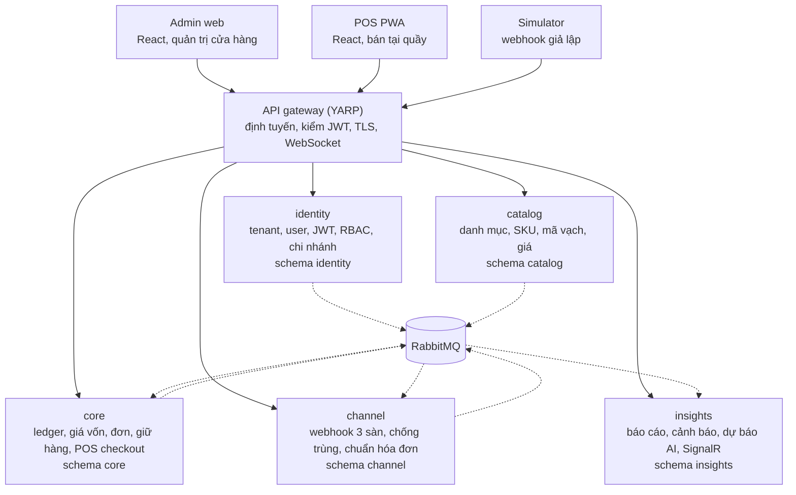

# OISM — Kế hoạch triển khai

Cập nhật: 2026-10-03 · Bản để comment: [Claude Doc](https://claude.ai/code/artifact/3dad8d52-a252-47bb-a023-840d44eacce0) (cần được chia sẻ quyền xem) · Nguồn yêu cầu: [bản dịch và phân tích đề](../OISM-ban-dich-va-phan-tich-tieng-Viet.md)

## 1. Đọc nhanh

OISM gồm 5 service .NET 8 sau một API gateway và hai ứng dụng React, do 3 dev làm trong 5 tuần, chia thành 10 phase, mỗi phase nửa tuần. Đơn hàng và tồn kho nằm chung service `core` để giữ đúng yêu cầu một transaction của đề (NFR-SEC-02, FR-POS-04). Lõi kho và giữ hàng phải chạy đúng trước cuối phase 4; mọi thứ khác xếp sau.

| Phase | Tuần | Dev A | Dev B | Dev C | Cổng cuối phase |
| --- | --- | --- | --- | --- | --- |
| 1. Khởi động | 1 | Skeleton, BuildingBlocks, gateway, compose | Danh mục, thương hiệu; outbox, Contracts | React workspace, login, CI | Compose chạy, gateway tới 5 service, CI có check |
| 2. Định danh và danh mục | 1 | Identity, RBAC, chi nhánh, ERD | SKU, mã vạch, giá; consumer ở core | Admin: chi nhánh, danh mục | Login qua gateway; chi nhánh và SKU tới được core |
| 3. Sổ kho và mô hình đơn | 2 | Ledger chỉ thêm mới, số dư | Canonical Order, máy trạng thái | Admin: sản phẩm, SKU | Ledger chặn UPDATE/DELETE; bước trạng thái sai bị từ chối |
| 4. Giá vốn và giữ hàng | 2 | Phiếu nhập, WAC, chỉ mục | Engine giữ hàng, event đơn và tồn | Admin: nhập hàng, ledger | WAC = 110.000; 50 đơn chỉ 1 thắng |
| 5. Xác nhận đơn và POS | 3 | Chuyển kho | Xác nhận, hủy, POS checkout | POS PWA | Bán POS trọn luồng, in được |
| 6. Kênh sàn, hết hạn, kiểm kê | 3 | Kiểm kê | Channel, job hết hạn | Admin: đơn hàng | Đơn từ simulator được duyệt trên admin |
| 7. Báo cáo và realtime | 4 | Projection, báo cáo lợi nhuận | SignalR hub | Thông báo realtime, PWA | Báo cáo khớp ví dụ 80.000; đơn mới hiện ngay |
| 8. Cảnh báo, dự báo, giao diện | 4 | Cảnh báo tồn, màn hình kho | Dự báo AI | Dashboard, seed data | Mọi FR có luồng chạy từ UI tới DB |
| 9. Kiểm thử và đóng gói | 5 | Test cách ly tenant, coverage | Đo tải k6, coverage | Compose demo, CI | Coverage 80%; compose up trên máy sạch |
| 10. Tài liệu và bàn giao | 5 | URS, RTM, ERD, kiến trúc | UML, tài liệu kiểm thử | Swagger, hướng dẫn | RTM đủ 44 mã; demo hai lần không lỗi |

- Tìm việc của mình: mục 10 (Lịch 10 phase) theo cột Owner, hoặc file plan của folder mình sở hữu trong `docs/plans/` (mục 4.3).
- Trước khi code: đọc mục 3. Cả 18 quyết định đang là mặc định, chờ giảng viên xác nhận trong phase 1.
- Tài liệu chi tiết (yêu cầu, use case, kiến trúc, quyết định, thiết kế, kiểm thử, quy ước) nằm cùng thư mục này; bản đồ ở [README.md](README.md). Quy tắc cho công cụ AI ở [AGENTS.md](../AGENTS.md).
- Quỹ thời gian là 3 dev × 5 tuần = 75 ngày công. Riêng phần microservice tốn khoảng 22 ngày (ước lượng), nên nhóm P2 chỉ làm mức tối thiểu (mục 11).

## 2. Phạm vi

Nhóm làm đủ 30 FR và 11 NFR của đề, cộng dự báo nhập hàng bằng AI ở mức thống kê. Bảy hạng mục dưới đây không làm trong 5 tuần.

| Ngoài phạm vi | Lý do |
| --- | --- |
| Gọi API thật của Shopee, TikTok Shop, Lazada; đẩy tồn ngược về sàn | Đề chỉ yêu cầu bộ mô phỏng webhook (FR-SIM-01) |
| Bán hàng offline trên POS | Đề không nêu; cần chính sách phân bổ tồn và xử lý xung đột |
| Cổng thanh toán, đối soát QR tự động | Thu ngân xác nhận tay (D-11) |
| Hóa đơn điện tử, máy in chuyên dụng | Đề chỉ yêu cầu in qua trình duyệt (FR-POS-03) |
| Trả hàng và hoàn tiền đầy đủ | Đề không có FR riêng; ledger chỉ dành sẵn loại giao dịch `ReturnIn` |
| Quản trị viên toàn nền tảng | Đề chỉ có Owner, Staff, Cashier |
| Kubernetes, service mesh, tracing phân tán | Docker Compose đủ cho gói demo |

## 3. Quyết định mặc định

> Nguồn chuẩn: [decisions/](decisions/README.md). Bảng dưới là bản tóm tắt.

Cả 18 quyết định dưới đây là lựa chọn mặc định của nhóm cho những điểm đề chưa chốt; giảng viên cần xác nhận trong phase 1 (task W1-01). Hỏi D-17 trước: đề ghi "Clean Architecture" và ".NET 8 Web API", không yêu cầu microservice.

| # | Điểm đề chưa chốt | Mặc định | Trạng thái |
| --- | --- | --- | --- |
| D-01 | Mô hình tenant | Chung schema, cột `TenantId` trên mọi bảng nghiệp vụ, EF Core Global Query Filter | Chờ xác nhận |
| D-02 | Ledger và cột `on_hand` | Có bảng `InventoryBalance`; chỉ đổi trong cùng transaction với một dòng ledger; ledger là nguồn chuẩn, có test đối soát | Chờ xác nhận |
| D-03 | Cơ chế khóa | Khóa bi quan `SELECT ... FOR UPDATE` trên dòng số dư, khóa theo thứ tự SkuId | Chờ xác nhận |
| D-04 | Phạm vi giá vốn | Theo (chi nhánh, SKU), lưu trên dòng số dư; chuyển kho mang giá vốn nơi gửi, nơi nhận tính lại WAC | Chờ xác nhận |
| D-05 | Nghĩa của Confirmed | Confirmed là thời điểm xuất kho: trừ on_hand, giảm reserved, chốt `CostPrice`, ghi ledger. Completed là đã giao, không tác động tồn | Chờ xác nhận |
| D-06 | Hủy đơn | Chỉ hủy từ Draft hoặc Reserved; sau Confirmed không hủy; không làm trả hàng | Chờ xác nhận |
| D-07 | Ranh giới transaction | POS: một transaction cho cả chuỗi tới Completed. Đơn online: mỗi bước một transaction | Chờ xác nhận |
| D-08 | Giữ hàng | Hết hạn sau 30 phút, cấu hình được; đơn nhiều SKU giữ toàn bộ hoặc từ chối toàn bộ | Chờ xác nhận |
| D-09 | Kết nối sàn | Chỉ simulator webhook; Shopee, TikTok, Lazada cùng vào Canonical Order | Chờ xác nhận |
| D-10 | Chống xử lý trùng | Unique (TenantId, Channel, ExternalOrderId); bảng `WebhookEvent`; header `Idempotency-Key` cho POS checkout | Chờ xác nhận |
| D-11 | QR và offline | Hiển thị mã QR, thu ngân xác nhận tay; không bán offline, PWA chỉ cài được và cache app shell | Chờ xác nhận |
| D-12 | Công thức báo cáo | Doanh thu thuần = Σ(SL × đơn giá − giảm giá dòng) của đơn đã Confirmed, theo `ConfirmedAt`, giờ Việt Nam; không thuế, phí; bán chạy/chậm theo SL 30 ngày | Chờ xác nhận |
| D-13 | Chuyển kho, kiểm kê | Chuyển kho Draft → InTransit → Received, nhận đủ. Kiểm kê bị chặn khi số đếm nhỏ hơn reserved | Chờ xác nhận |
| D-14 | AI dự báo | Exponential smoothing theo (chi nhánh, SKU), viết bằng C#, chạy đêm bằng Hangfire; backtest WAPE so với naive; mã tạm FR-AI-01..03 | Chờ xác nhận |
| D-15 | Xác thực và quyền | BCrypt; access token 60 phút; refresh 7 ngày, xoay vòng, thu hồi khi logout; user thuộc một tenant; `Branch` có `Type` Store/Warehouse; báo cáo lợi nhuận chỉ Owner xem | Chờ xác nhận |
| D-16 | Tổ chức frontend | npm workspaces `frontend/` gồm `admin`, `pos`, `shared` (Vite, React, TypeScript) | Chờ xác nhận |
| D-17 | Kiến trúc triển khai | Microservice: 5 service và một gateway; đơn hàng và tồn kho chung service `core` | Chờ xác nhận |
| D-18 | Giao tiếp và dữ liệu | RabbitMQ với transactional outbox; một database PostgreSQL dùng chung, mỗi service một schema riêng | Chờ xác nhận |

Bốn quyết định tốn công nhất nếu bị đổi:

- D-17 về monolith: gộp 5 service thành một API, bỏ gateway và RabbitMQ, lấy lại khoảng 22 ngày công.
- D-02 cấm bảng số dư: tính tồn từ ledger và đổi cách khóa; viết lại W2-01 và W2-05.
- D-05 thêm trạng thái xuất kho riêng: dời bước trừ tồn và chốt giá vốn khỏi Confirmed.
- D-06 bắt buộc có trả hàng: thêm luồng `ReturnIn`, khoảng 3 ngày công.

## 4. Kiến trúc và cấu trúc repo

> Nguồn chuẩn: [architecture/](architecture/README.md). Mục này là bản tóm tắt.

Ranh giới service đi theo ranh giới transaction: thứ gì phải commit cùng nhau thì ở chung một service và một schema. Vì vậy đơn hàng, giữ hàng, ledger và giá vốn nằm trong `core`; bốn service còn lại nối với `core` bằng event.



Đường liền là HTTP đi qua gateway; đường đứt là event qua RabbitMQ. `core` và `channel` vừa phát vừa nhận event; `insights` chỉ nhận.

| Thành phần | Yêu cầu phụ trách | Owner |
| --- | --- | --- |
| `gateway` | Định tuyến, kiểm JWT, TLS (NFR-SEC-01) | Dev A |
| `identity` | FR-AUTH-01..04 | Dev A |
| `catalog` | FR-PROD-01..04 | Dev B |
| `core`, module Inventory | FR-INV-01..04, FR-COST-01 | Dev A |
| `core`, module Orders | FR-ORD-01..03, FR-RSE-01..03, FR-COST-02, FR-POS-02, FR-POS-04, job hết hạn giữ hàng (FR-SIM-03) | Dev B |
| `channel` | FR-SIM-01, phần adapter của FR-ORD-01 | Dev B |
| `insights` | FR-REP-01..03, FR-AI-01..03, tổng hợp ngày (FR-SIM-03), SignalR (FR-SIM-02) | Dev A (báo cáo), Dev B (AI, SignalR) |
| `admin`, `pos` | Giao diện của mọi FR; FR-POS-01, FR-POS-03 | Dev C |

Bốn quy tắc áp cho mọi service:

- Bốn lớp Clean Architecture: Domain, Application, Infrastructure, Api (NFR-MAINT-01). Domain không tham chiếu EF Core.
- Một schema riêng trong database `oism` dùng chung. Không join và không khóa ngoại chéo schema.
- `TenantId` lấy từ JWT và áp qua Global Query Filter trong `Oism.BuildingBlocks` (NFR-TENANT-01). Event mang `TenantId`; consumer đặt lại ngữ cảnh tenant trước khi xử lý.
- Service không gọi HTTP sang service khác. Dữ liệu tham chiếu đi bằng event và lưu bản sao cục bộ.

### 4.1 Phân tầng hệ thống

Hệ thống chia 5 tầng. Tầng trên chỉ gọi xuống tầng dưới; frontend không bao giờ gọi thẳng service hay database.

| Tầng | Thành phần | Folder | Trách nhiệm |
| --- | --- | --- | --- |
| 1. Giao diện | Admin web, POS PWA | `frontend/admin`, `frontend/pos`, `frontend/shared` | Hiển thị, nhập liệu, gọi API qua gateway |
| 2. Cổng vào | API gateway | `backend/gateway` | Định tuyến, kiểm JWT, TLS, WebSocket |
| 3. Dịch vụ | identity, catalog, core, channel, insights | `backend/services/*` | Nghiệp vụ; mỗi service bốn lớp (mục 4.2) |
| 4. Thông điệp | RabbitMQ, outbox, inbox | `backend/shared` | Event giữa các service (mục 7) |
| 5. Dữ liệu | PostgreSQL, một database `oism`, mỗi service một schema | `deploy/postgres`, migration trong từng service | Lưu trữ, khóa dòng, ràng buộc |

### 4.2 Phân lớp trong mỗi service

Mỗi service có bốn project theo Clean Architecture; phụ thuộc chỉ hướng vào trong, về phía Domain.

| Lớp | Project | Chứa gì | Được tham chiếu tới |
| --- | --- | --- | --- |
| Domain | `Oism.<Service>.Domain` | Entity, value object, quy tắc nghiệp vụ (WAC, giữ hàng, máy trạng thái) | Không lớp nào |
| Application | `Oism.<Service>.Application` | Use case (command, query, handler), interface repository và message bus, validation | Domain |
| Infrastructure | `Oism.<Service>.Infrastructure` | EF Core DbContext, migration, repository, outbox và inbox, RabbitMQ, Hangfire | Application, Domain |
| Api | `Oism.<Service>.Api` | Controller, consumer, SignalR hub, đăng ký DI, Swagger | Application; Infrastructure chỉ để đăng ký DI |

Frontend có ba lớp: `pages` (màn hình và route) gọi `features` (logic theo nghiệp vụ), `features` gọi `frontend/shared` (API client, auth, kiểu dữ liệu). `admin` và `pos` không tham chiếu lẫn nhau.

### 4.3 Cấu trúc repo và plan theo folder

```text
XDPMOOP/
├─ AGENTS.md, CLAUDE.md         quy tắc cho công cụ AI
├─ .claude/                     rule và skill của Claude Code
├─ backend/
│  ├─ Oism.sln
│  ├─ shared/
│  │  ├─ Oism.SharedKernel/     ITenantOwned, exception gốc; thứ duy nhất Domain được tham chiếu
│  │  ├─ Oism.BuildingBlocks/   tenant context, query filter, JWT, outbox/inbox, lỗi chuẩn
│  │  └─ Oism.Contracts/        event và command dùng chung
│  ├─ gateway/Oism.Gateway/     YARP
│  └─ services/
│     ├─ identity/              Domain, Application, Infrastructure, Api, tests
│     ├─ catalog/
│     ├─ core/                  hai module: Inventory, Orders
│     ├─ channel/
│     └─ insights/
├─ frontend/
│  ├─ admin/                    React, trang quản trị
│  ├─ pos/                      React PWA, bán tại quầy
│  └─ shared/                   API client, auth, kiểu dữ liệu
├─ deploy/
│  ├─ docker-compose.yml
│  └─ postgres/init-schemas.sql
├─ tools/k6/                    kịch bản đo tải
├─ docs/                        PLAN.md, plans/, requirements/, usecase-userstory/, architecture/, decisions/, design/, testing/, conventions/
└─ .github/workflows/ci.yml
```

Plan của từng folder nằm trong `docs/plans/`; mỗi file ghi phân lớp, việc theo phase và phần folder đó sở hữu.

| Folder | Owner | Plan |
| --- | --- | --- |
| `backend/shared` | A (BuildingBlocks), B (outbox, Contracts) | [backend-shared.md](plans/backend-shared.md) |
| `backend/gateway` | A | [backend-gateway.md](plans/backend-gateway.md) |
| `backend/services/identity` | A | [backend-services-identity.md](plans/backend-services-identity.md) |
| `backend/services/catalog` | B | [backend-services-catalog.md](plans/backend-services-catalog.md) |
| `backend/services/core` | A (Inventory), B (Orders) | [backend-services-core.md](plans/backend-services-core.md) |
| `backend/services/channel` | B | [backend-services-channel.md](plans/backend-services-channel.md) |
| `backend/services/insights` | A (báo cáo), B (AI, SignalR) | [backend-services-insights.md](plans/backend-services-insights.md) |
| `frontend/shared` | C | [frontend-shared.md](plans/frontend-shared.md) |
| `frontend/admin` | C; A nhận màn hình kho ở phase 8 | [frontend-admin.md](plans/frontend-admin.md) |
| `frontend/pos` | C | [frontend-pos.md](plans/frontend-pos.md) |
| `deploy` | C; A dựng Compose dev ở phase 1 | [deploy.md](plans/deploy.md) |
| `tools/k6` | B | [tools-k6.md](plans/tools-k6.md) |

Công nghệ: .NET 8, ASP.NET Core, EF Core với Npgsql, PostgreSQL, RabbitMQ, YARP, SignalR, Hangfire, React với Vite và TypeScript, xUnit với Testcontainers, k6, Docker Compose, GitHub Actions.

## 5. Mô hình dữ liệu

> Nguồn chuẩn: [design/data-model/](design/data-model/core.md). Bảng dưới là bản tóm tắt.

Mọi bảng nghiệp vụ có cột `TenantId`; bảng dưới chỉ ghi các trường và ràng buộc quyết định tính đúng. ERD đầy đủ do Dev A vẽ ở phase 2 (W1-12).

| Service | Bảng | Trường và ràng buộc chính |
| --- | --- | --- |
| identity | Tenant, User, RefreshToken | Email và số điện thoại unique; `PasswordHash` BCrypt; refresh token lưu dạng băm |
| identity | Branch | `Type` Store/Warehouse, `IsActive`; unique (TenantId, Code) |
| catalog | Category, Brand, Product | Category có `ParentId` |
| catalog | Sku | Unique (TenantId, SkuCode); `RetailPrice`, `WholesalePrice` |
| catalog | Barcode | Unique (TenantId, Code); `Symbology` EAN-13 hoặc Code128 |
| core | SkuRef, BranchRef | Bản sao từ event; đủ tên, mã vạch, giá lẻ để POS tra trong một lần gọi |
| core | InventoryBalance | Khóa chính (TenantId, BranchId, SkuId); `OnHand`, `Reserved`, `AvgCost`, `ReorderThreshold`; CHECK `Reserved >= 0 AND Reserved <= OnHand` |
| core | InventoryTransaction | `Seq` tăng dần, `Type` IN/OUT, `Reason`, `Quantity`, `BalanceAfter`, `UnitCost`, `ReferenceType`, `ReferenceId`, `ReversalOfId`, `CreatedBy`; trigger chặn UPDATE và DELETE; chỉ mục (TenantId, CreatedAt) và (TenantId, BranchId, SkuId, Seq) |
| core | Supplier, PurchaseReceipt, PurchaseReceiptItem | `Status` Draft/Confirmed; dòng có `Quantity`, `UnitCost` |
| core | StockTransfer, StockTransferItem | `Status` Draft/InTransit/Received; dòng mang `UnitCost` của nơi gửi |
| core | Stocktake, StocktakeItem | `SystemQty`, `CountedQty` |
| core | Order | `Channel`, `Status`, `ReservedUntil`, `ConfirmedAt`; unique (TenantId, Channel, ExternalOrderId) và (TenantId, IdempotencyKey); chỉ mục (TenantId, CreatedAt) |
| core | OrderItem | `Quantity`, `UnitPrice`, `Discount`, `CostPrice`; chỉ mục (TenantId, SkuId) |
| core | Reservation | Theo (OrderId, BranchId, SkuId); `Status` Active/Consumed/Released; `ExpiresAt` |
| core | Payment | `Method` Cash/QR, `Amount`, `ConfirmedBy` |
| channel | ChannelShop, WebhookEvent | ChannelShop ánh xạ shop của sàn sang tenant và chi nhánh; WebhookEvent unique (TenantId, Channel, EventId) |
| insights | SalesFact | Một dòng cho mỗi OrderItem đã xác nhận; unique (OrderItemId); `Revenue`, `Cogs`, `ConfirmedAt` |
| insights | StockSnapshot, DailyAggregate | Tồn mới nhất theo (chi nhánh, SKU); tổng hợp theo ngày, chi nhánh, kênh, SKU |
| insights | ForecastRun, ForecastResult | `ForecastQty`, `SuggestedReorderQty`, `Wape` theo (chi nhánh, SKU) |
| service có event | OutboxMessage, InboxMessage | Inbox unique (EventId) |

- `Reason` của ledger nhận một trong: Purchase, Sale, TransferOut, TransferIn, StocktakeAdjust, ReturnIn, Reversal.
- `Channel` của đơn nhận một trong: POS, Admin, Shopee, TikTok, Lazada.
- Tiền và giá vốn lưu `numeric(18,4)`. Thời gian lưu UTC; báo cáo quy về giờ Việt Nam.
- Sửa sai ledger bằng một dòng mới có `Reason` Reversal và `ReversalOfId` trỏ về dòng gốc (NFR-SEC-03).

## 6. Luồng lõi và ranh giới transaction

> Nguồn chuẩn: [design/flows/](design/flows/) và [architecture/transactions-and-concurrency.md](architecture/transactions-and-concurrency.md).

Mỗi luồng dưới đây là một transaction database trong `core`; lỗi ở bất kỳ bước nào thì rollback toàn bộ (NFR-SEC-02). Mọi thay đổi `OnHand` đi qua một hàm duy nhất `PostLedger`, hàm này vừa ghi dòng ledger vừa cập nhật số dư. Khi cần khóa nhiều dòng số dư, luôn khóa theo thứ tự SkuId tăng dần.

### 6.1 Nhập hàng (FR-INV-02, FR-COST-01)

1. Khóa phiếu nhập. Phiếu đã Confirmed thì trả kết quả cũ, không làm gì thêm.
2. Khóa dòng `InventoryBalance` của từng SKU, tạo dòng nếu chưa có.
3. Tính `AvgCost` mới = (OnHand × AvgCost + SL nhập × đơn giá nhập) / (OnHand + SL nhập).
4. Tăng `OnHand`, ghi một dòng ledger IN/Purchase kèm `BalanceAfter` và `UnitCost`.
5. Đổi phiếu sang Confirmed, ghi outbox `StockChanged`.

### 6.2 Giữ hàng cho đơn online (FR-RSE-01, FR-RSE-02)

1. Chèn `Order` ở Draft. Unique (TenantId, Channel, ExternalOrderId) chặn đơn trùng.
2. Khóa các dòng số dư của mọi SKU trong đơn.
3. Nếu bất kỳ SKU nào có OnHand − Reserved nhỏ hơn số lượng đặt: rollback, phát `OrderRejected`.
4. Tăng `Reserved`, tạo `Reservation` Active với `ExpiresAt` = hiện tại + 30 phút, đơn sang Reserved.
5. Ghi outbox `OrderReserved` và `StockChanged`. Không ghi ledger vì `OnHand` chưa đổi.

### 6.3 Xác nhận đơn (FR-RSE-03, FR-COST-02)

1. Khóa `Order`; chỉ nhận khi đơn đang Reserved.
2. Khóa các dòng số dư.
3. Với mỗi dòng đơn: giảm `OnHand` và `Reserved`, ghi `OrderItem.CostPrice` = `AvgCost` hiện tại, ghi ledger OUT/Sale.
4. `Reservation` sang Consumed, đơn sang Confirmed, ghi `ConfirmedAt`.
5. Ghi outbox `OrderConfirmed` (kèm dòng đơn, giá bán, giá vốn) và `StockChanged`.

### 6.4 Hủy hoặc hết hạn giữ hàng (FR-RSE-03, FR-SIM-03)

1. Khóa `Order`; chỉ nhận khi Draft hoặc Reserved. Trạng thái khác thì kết thúc, không đổi gì.
2. Khóa số dư, giảm `Reserved` đúng bằng các `Reservation` còn Active, chuyển chúng sang Released.
3. Đơn sang Cancelled, ghi outbox `OrderCancelled` và `StockChanged`.

Job hết hạn và thao tác xác nhận cùng khóa dòng `Order`, nên chỉ một bên thắng.

### 6.5 POS checkout (FR-POS-04)

1. Tra `Idempotency-Key`; đã có thì trả đơn cũ.
2. Chạy bước giữ hàng (6.2) rồi bước xác nhận (6.3) trong cùng một transaction.
3. Ghi `Payment` (tiền mặt hoặc QR do thu ngân xác nhận), đơn sang Completed.
4. Commit xong mới trả hóa đơn cho POS in. In lỗi không tạo thêm đơn.

### 6.6 Chuyển kho (FR-INV-03)

Hai transaction, mỗi bước một lần commit.

1. Xuất: khóa số dư chi nhánh gửi, kiểm available, giảm `OnHand`, ghi ledger OUT/TransferOut với `UnitCost` = `AvgCost` nơi gửi, phiếu sang InTransit.
2. Nhận: khóa số dư chi nhánh nhận, tính lại WAC bằng `UnitCost` mang theo, tăng `OnHand`, ghi ledger IN/TransferIn, phiếu sang Received.

### 6.7 Kiểm kê (FR-INV-04)

1. Khi chốt phiên, khóa số dư của từng SKU đã đếm.
2. Số đếm nhỏ hơn `Reserved`: từ chối và trả danh sách đơn đang giữ để nhân viên xử lý trước.
3. Có chênh lệch: ghi ledger IN hoặc OUT với `Reason` StocktakeAdjust, đặt `OnHand` = số đếm, giữ nguyên `AvgCost`.

## 7. Event giữa các service

> Nguồn chuẩn: [design/events.md](design/events.md) và [architecture/messaging.md](architecture/messaging.md).

Các service chỉ nói chuyện với nhau qua 8 thông điệp dưới đây, định nghĩa trong `backend/shared/Oism.Contracts`.

| Thông điệp | Phát | Nhận | Nội dung chính |
| --- | --- | --- | --- |
| `BranchUpserted` | identity | core | branchId, name, type, isActive |
| `SkuUpserted` | catalog | core, insights | skuId, skuCode, name, barcodes, retailPrice, wholesalePrice, isActive |
| `SubmitOrder` | channel | core | channel, externalOrderId, branchId, các dòng (skuCode, quantity, unitPrice) |
| `OrderReserved` | core | insights, channel | orderId, branchId, channel, reservedUntil |
| `OrderRejected` | core | channel, insights | externalOrderId, lý do, SKU thiếu hàng |
| `OrderConfirmed` | core | insights | orderId, branchId, channel, confirmedAt, các dòng (skuId, quantity, unitPrice, discount, costPrice) |
| `OrderCancelled` | core | insights | orderId, lý do (nhân viên hủy hoặc hết hạn) |
| `StockChanged` | core | insights | branchId, skuId, onHand, reserved, available, avgCost, threshold |

- Mọi thông điệp có `eventId`, `tenantId`, `occurredAt`.
- Bên phát ghi vào `OutboxMessage` trong cùng transaction với thay đổi nghiệp vụ; một tiến trình nền đẩy sang RabbitMQ.
- Bên nhận ghi `eventId` vào `InboxMessage` trước khi xử lý; bản trùng bị bỏ qua.
- Đổi hợp đồng chỉ được thêm trường. PR phải có cả dev bên phát và bên nhận duyệt.
- Hệ quả phải chấp nhận: SKU hoặc chi nhánh vừa tạo có ở `core` sau một nhịp event; báo cáo và cảnh báo tồn trễ theo event.

## 8. API theo service

> Nguồn chuẩn: [design/api/](design/api/README.md). Bảng dưới chỉ liệt kê endpoint chính.

Frontend chỉ gọi qua gateway, đường dẫn dạng `/api/<service>/...`. Bảng liệt kê endpoint chính; chi tiết nằm ở Swagger của từng service.

| Service | Endpoint | Vai trò |
| --- | --- | --- |
| identity | `POST /tenants` (đăng ký tenant kèm Owner) | Công khai |
| identity | `POST /auth/login`, `/auth/refresh`, `/auth/logout` | Mọi vai trò |
| identity | `GET, POST, PUT /users` | Owner |
| identity | `GET, POST, PUT /branches`, `PATCH /branches/{id}/active` | Owner |
| catalog | CRUD `/categories`, `/brands` | Owner, Staff |
| catalog | CRUD `/products`, `/products/{id}/skus` | Owner, Staff |
| catalog | `POST /skus/{id}/barcodes` (tự sinh hoặc nhập tay) | Owner, Staff |
| catalog | `PUT /skus/{id}/prices` | Owner |
| core | `GET /pos/skus?query=` (SKU kèm available tại chi nhánh) | Cashier, Staff, Owner |
| core | `POST /pos/checkout` với header `Idempotency-Key` | Cashier, Owner |
| core | `GET /stock`, `PUT /stock/threshold`, `GET /ledger` | Owner, Staff |
| core | `POST /purchase-receipts`, `POST /purchase-receipts/{id}/confirm` | Owner, Staff |
| core | `POST /transfers`, `/transfers/{id}/ship`, `/transfers/{id}/receive` | Owner, Staff |
| core | `POST /stocktakes`, `PUT /stocktakes/{id}/counts`, `POST /stocktakes/{id}/post` | Owner, Staff |
| core | `GET /orders`, `POST /orders` (đơn thủ công), `POST /orders/{id}/confirm`, `/complete`, `/cancel` | Owner, Staff |
| channel | `POST /webhooks/{channel}` (chữ ký giả lập, không JWT) | Simulator |
| channel | `POST /simulator/burst`, `GET /webhook-events` | Owner |
| insights | `GET /reports/gross-profit` lọc theo thời gian, chi nhánh, kênh, SKU | Owner |
| insights | `GET /reports/inventory-value`, `/reports/top-sellers`, `/reports/slow-movers` | Owner, Staff |
| insights | `GET /alerts/low-stock` | Owner, Staff |
| insights | `GET /forecast/reorder-suggestions`, `POST /forecast/run` | Owner |
| insights | WebSocket `/hubs/notifications`, group theo tenant và chi nhánh | Mọi vai trò |

Lỗi trả về theo một định dạng chung (ProblemDetails): 409 cho thiếu hàng hoặc chuyển trạng thái sai, 404 cho dữ liệu của tenant khác.

## 9. Phân công

Mỗi dev sở hữu trọn một nhóm service; `core` và `insights` chia theo module.

| Dev | Track | Sở hữu code | Sở hữu tài liệu |
| --- | --- | --- | --- |
| A | Nền tảng, kho, giá vốn | `gateway`, `Oism.BuildingBlocks`, `identity`, `core` module Inventory, `insights` phần báo cáo | URS, RTM, ERD, tài liệu kiến trúc |
| B | Sản phẩm, đơn hàng, realtime | `catalog`, `core` module Orders, `channel`, `Oism.Contracts`, `insights` phần AI và SignalR | UML class, sequence diagram, tài liệu kiểm thử |
| C | Frontend, DevOps | `admin`, `pos`, `shared`, Docker Compose, CI, seed data, Swagger và Postman | Hướng dẫn cài đặt, hướng dẫn sử dụng, kế hoạch triển khai |

- Duyệt PR: A duyệt cho B, B duyệt cho A; PR của C do người sở hữu API liên quan duyệt.
- Phase 8, Dev A nhận hai màn hình chuyển kho và kiểm kê để giảm tải cho Dev C.

## 10. Lịch 10 phase

Mỗi phase dài nửa tuần (khoảng 2,5 ngày làm việc) và kết thúc bằng một cổng; track nào chưa qua cổng thì chưa mở task phase sau của track đó. Mã task giữ dạng `W<tuần>-<số>` và dùng làm tiền tố nhánh và commit.

### Ma trận phase × folder

| Phase | `backend/shared`, `gateway` | `identity`, `catalog` | `core` | `channel`, `insights` | `frontend` | `deploy`, `tools`, CI | `docs` |
| --- | --- | --- | --- | --- | --- | --- | --- |
| 1 | W1-02, W1-03, W1-13 | W1-06 | | | W1-09 | W1-03, W1-11 | W1-01 |
| 2 | | W1-04, W1-05, W1-07, W1-12 | W1-08 | | W1-10 | | W1-12 |
| 3 | | | W2-01, W2-04 | | W2-07 | | |
| 4 | | | W2-02, W2-03, W2-05, W2-06 | | W2-08 | | W2-09 |
| 5 | | | W3-01, W3-02, W3-05 | | W3-07 | | |
| 6 | | | W3-04, W3-06 | W3-03 | W3-08 | | W3-09 |
| 7 | | | | W4-01, W4-02, W4-04 | W4-08 | | |
| 8 | | | | W4-03, W4-05 | W4-06, W4-07 | W4-09 | |
| 9 | W5-04 | W5-02 | W5-01, W5-02 | W5-02 | | W5-03, W5-04, W5-05 | |
| 10 | W5-06 | | | | | | W5-07, W5-08, W5-09 |

Mỗi folder có file plan riêng trong `docs/plans/`, ghi việc của folder đó theo phase (mục 4.3).

### Phase 1: khởi động (tuần 1, nửa đầu)

| Mã | Việc | Owner | Yêu cầu | Xong khi |
| --- | --- | --- | --- | --- |
| W1-01 | Chốt D-01 đến D-18 với giảng viên, cập nhật mục 3 | A chủ trì, cả nhóm | Mục 3 | Mỗi quyết định có trạng thái; task bị ảnh hưởng đã sửa |
| W1-02 | Skeleton repo, `Oism.BuildingBlocks` (tenant context, Global Query Filter, kiểm JWT, lỗi chuẩn), mẫu service bốn lớp | A | NFR-MAINT-01, NFR-TENANT-01 | `dotnet build` xanh; test: entity có TenantId tự bị lọc |
| W1-03 | Docker Compose dev: PostgreSQL một database với 5 schema, RabbitMQ, gateway YARP | A | NFR-SEC-01 | `docker compose up` chạy; health check 5 service qua gateway |
| W1-06 | catalog: danh mục phân cấp, thương hiệu | B | FR-PROD-01 | CRUD và test cây danh mục |
| W1-13 | shared: outbox và inbox trong `Oism.BuildingBlocks`, kết nối RabbitMQ, `Oism.Contracts` với `BranchUpserted` và `SkuUpserted` | B | NFR-SEC-02 | Event mẫu đi từ outbox tới consumer; gửi lại không xử lý trùng |
| W1-09 | frontend: npm workspaces, API client, đăng ký tenant, login và refresh, layout, chặn route theo vai trò | C | FR-AUTH-01, FR-AUTH-02, FR-AUTH-03 | Đăng ký tenant rồi đăng nhập được trên admin và pos |
| W1-11 | CI: GitHub Actions build và test backend, build frontend | C | Mục e.7 của đề | PR hiện check xanh hoặc đỏ |

Cổng phase 1: `docker compose up` chạy được; gateway định tuyến tới 5 service; một event mẫu đi từ outbox tới consumer; PR có check CI.

### Phase 2: định danh và danh mục (tuần 1, nửa sau)

| Mã | Việc | Owner | Yêu cầu | Xong khi |
| --- | --- | --- | --- | --- |
| W1-04 | identity: đăng ký tenant, login bằng email hoặc số điện thoại, JWT (TenantId, UserId, Role), refresh, logout, RBAC | A | FR-AUTH-01..03, NFR-SEC-01 | JWT đủ claim; Cashier gọi API quản trị nhận 403 |
| W1-05 | identity: CRUD chi nhánh, bật/tắt, phát `BranchUpserted` qua outbox | A | FR-AUTH-04 | Tạo chi nhánh xong, `core` có BranchRef |
| W1-07 | catalog: sản phẩm, biến thể/SKU, mã vạch EAN-13/Code128, giá lẻ và giá sỉ; phát `SkuUpserted` | B | FR-PROD-02..04 | SKU trùng trong tenant bị từ chối; EAN-13 đúng số kiểm tra |
| W1-08 | core: skeleton, consumer `SkuUpserted` và `BranchUpserted` vào SkuRef, BranchRef | B | NFR-TENANT-01 | Gửi lại cùng event không tạo bản ghi trùng |
| W1-12 | Rà ERD ở `docs/design/data-model/` theo migration thật; test cách ly tenant cho identity và catalog | A (ERD), B (test) | NFR-TENANT-01 | ERD khớp migration; tenant A gọi ID của tenant B nhận 404 |
| W1-10 | admin: màn hình chi nhánh, người dùng, danh mục, thương hiệu | C | FR-AUTH-03, FR-AUTH-04, FR-PROD-01 | CRUD từ giao diện |

Cổng phase 2: đăng nhập Owner qua gateway; tạo chi nhánh và danh mục từ giao diện, tạo SKU qua API; `core` nhận được cả hai event.

### Phase 3: sổ kho và mô hình đơn (tuần 2, nửa đầu)

| Mã | Việc | Owner | Yêu cầu | Xong khi |
| --- | --- | --- | --- | --- |
| W2-01 | core/Inventory: `InventoryTransaction` chỉ thêm mới (trigger chặn UPDATE và DELETE), `InventoryBalance`, hàm `PostLedger` | A | FR-INV-01, NFR-SEC-03 | UPDATE/DELETE bị database từ chối; OnHand bằng tổng ledger |
| W2-04 | core/Orders: Canonical Order, OrderItem, máy trạng thái, API tạo đơn thủ công | B | FR-ORD-01, FR-ORD-02 | Bước chuyển trạng thái sai bị từ chối |
| W2-07 | admin: sản phẩm, SKU, mã vạch, giá | C | FR-PROD-02..04 | Tạo sản phẩm có biến thể, mã vạch, giá lẻ và sỉ từ giao diện |

Cổng phase 3: UPDATE/DELETE ledger bị database từ chối; bước chuyển trạng thái sai bị từ chối; tạo được sản phẩm có biến thể từ giao diện.

### Phase 4: giá vốn và giữ hàng (tuần 2, nửa sau)

| Mã | Việc | Owner | Yêu cầu | Xong khi |
| --- | --- | --- | --- | --- |
| W2-02 | core/Inventory: phiếu nhập nháp rồi xác nhận, tăng OnHand, tính lại WAC | A | FR-INV-02, FR-COST-01 | 10 × 100.000 rồi 5 × 130.000 ra 110.000; xác nhận lại không đổi tồn |
| W2-03 | core: chỉ mục (TenantId, CreatedAt) và (TenantId, BranchId, SkuId) cho ledger và đơn | A | NFR-TENANT-02 | Migration có chỉ mục; EXPLAIN dùng index |
| W2-05 | core/Orders: engine giữ hàng, khóa FOR UPDATE theo thứ tự SkuId, giữ toàn bộ hoặc từ chối | B | FR-RSE-01, FR-RSE-02, NFR-PERF-02 | 50 request đồng thời cho 1 sản phẩm: đúng 1 thành công |
| W2-06 | core: phát `OrderReserved`, `OrderRejected`, `StockChanged` qua outbox | B | NFR-SEC-02 | Event chỉ phát khi transaction commit; RabbitMQ tắt vẫn commit được |
| W2-08 | admin: phiếu nhập, tồn theo chi nhánh, xem ledger | C | FR-INV-01, FR-INV-02 | Nhập hàng từ giao diện, thấy dòng ledger và giá vốn mới |
| W2-09 | Rà sequence diagram nhập hàng, giữ hàng theo code thật | A, B | Mục e.3 của đề | Sơ đồ ở `docs/design/flows/` khớp code đã merge |

Cổng phase 4: test WAC ra 110.000; test 50 request chỉ 1 thành công và tồn không âm; RabbitMQ tắt vẫn commit được.

### Phase 5: xác nhận đơn và POS (tuần 3, nửa đầu)

| Mã | Việc | Owner | Yêu cầu | Xong khi |
| --- | --- | --- | --- | --- |
| W3-05 | core/Inventory: chuyển kho hai bước, mang giá vốn | A | FR-INV-03 | B chưa nhận thì available của B không tăng; tổng A + đang chuyển + B không đổi |
| W3-01 | core/Orders: xác nhận đơn (trừ tồn, chốt `CostPrice`, ghi ledger), hoàn tất, hủy từ Reserved | B | FR-RSE-03, FR-COST-02, FR-ORD-03, NFR-SEC-02 | Lỗi giữa chừng rollback hết; hủy hai lần chỉ giải phóng một lần |
| W3-02 | core: POS checkout một transaction, `Idempotency-Key`, endpoint tìm SKU kèm available | B | FR-POS-02, FR-POS-04, NFR-SEC-02 | Bấm thanh toán hai lần chỉ một đơn; POS và online tranh đơn vị cuối không vượt tồn |
| W3-07 | pos: tìm theo tên, SKU, mã vạch; giỏ hàng; phím tắt; tiền mặt và QR; in qua trình duyệt | C | FR-POS-01, FR-POS-03, NFR-USA-02 | Quét mã rồi Enter là xong đơn; chạy tốt trên desktop, tablet, điện thoại |

Cổng phase 5: bán POS chạy trọn luồng và in được; bấm thanh toán hai lần chỉ một đơn; hàng chuyển kho chưa nhận thì chi nhánh nhận chưa bán được.

### Phase 6: kênh sàn, hết hạn, kiểm kê (tuần 3, nửa sau)

| Mã | Việc | Owner | Yêu cầu | Xong khi |
| --- | --- | --- | --- | --- |
| W3-06 | core/Inventory: kiểm kê, bút toán điều chỉnh, chặn khi số đếm nhỏ hơn reserved | A | FR-INV-04 | Điều chỉnh tạo dòng ledger; ca thiếu bị chặn kèm danh sách đơn |
| W3-03 | channel: nhận webhook ba sàn, chống trùng, chuẩn hóa, gửi `SubmitOrder`; công cụ bắn tải | B | FR-SIM-01, FR-ORD-01 | Gửi lại cùng webhook không tạo đơn thứ hai; bắn được 50 đơn đồng thời |
| W3-04 | core: job Hangfire hủy đơn Reserved hết hạn | B | FR-SIM-03 | Xác nhận đúng lúc job chạy: chỉ một kết quả thắng |
| W3-08 | admin: danh sách đơn đa kênh, tạo đơn thủ công, duyệt, hủy, in phiếu giao | C | FR-ORD-01, FR-ORD-03 | Duyệt được đơn từ simulator trên giao diện |
| W3-09 | Rà sequence diagram POS checkout, xác nhận, hủy và hết hạn, chuyển kho theo code thật | B, A | Mục e.3 của đề | Sơ đồ ở `docs/design/flows/` khớp code đã merge |

Cổng phase 6: đơn từ simulator vào Reserved rồi được duyệt trên admin; job hết hạn và thao tác xác nhận không cùng thắng.

### Phase 7: báo cáo và realtime (tuần 4, nửa đầu)

| Mã | Việc | Owner | Yêu cầu | Xong khi |
| --- | --- | --- | --- | --- |
| W4-01 | insights: consumer `OrderConfirmed`, `OrderCancelled`, `StockChanged` vào SalesFact, StockSnapshot | A | FR-REP-01, FR-REP-02 | Phát lại event không cộng trùng |
| W4-02 | insights: báo cáo doanh thu, giá vốn, lợi nhuận gộp; lọc bốn chiều; tổng hợp ngày bằng Hangfire | A | FR-REP-01, FR-SIM-03, NFR-PERF-01 | Ví dụ 300.000 − 220.000 = 80.000 khớp; dưới 2 giây với 100.000 bản ghi |
| W4-04 | insights: SignalR hub, group theo tenant và chi nhánh, đẩy đơn mới và cảnh báo tồn | B | FR-SIM-02 | Phiên của tenant khác không nhận thông báo |
| W4-08 | admin và pos: nhận thông báo SignalR (âm thanh, popup); PWA manifest và service worker | C | FR-SIM-02, FR-POS-01 | Đơn mới hiện không cần tải lại; POS cài được lên màn hình chính |

Cổng phase 7: API báo cáo lợi nhuận gộp khớp ví dụ 80.000; đơn mới hiện trên admin và POS không cần tải lại.

### Phase 8: cảnh báo, dự báo, giao diện (tuần 4, nửa sau)

| Mã | Việc | Owner | Yêu cầu | Xong khi |
| --- | --- | --- | --- | --- |
| W4-03 | insights: giá trị tồn theo giá vốn, bán chạy và bán chậm 30 ngày, cảnh báo available ≤ Threshold | A | FR-REP-02, FR-REP-03 | Hạ tồn dưới ngưỡng thì cảnh báo xuất hiện |
| W4-06 | admin: màn hình chuyển kho, kiểm kê | A | FR-INV-03, FR-INV-04 | Thao tác trọn luồng từ giao diện |
| W4-05 | insights: dự báo exponential smoothing, job đêm, API đề xuất nhập, backtest WAPE | B | FR-AI-01..03 | Có báo cáo backtest trên seed; SKU thiếu lịch sử hiện "chưa đủ dữ liệu" |
| W4-07 | admin: dashboard báo cáo, cảnh báo tồn, đề xuất nhập hàng | C | FR-REP-01..03, FR-AI-02 | Lọc đủ thời gian, chi nhánh, kênh, SKU |
| W4-09 | Seed data: 2 tenant, mỗi tenant 2 chi nhánh, khoảng 50 SKU, 60 ngày lịch sử bán | C, có A và B hỗ trợ | Mục f của đề | Script chạy lặp lại được |

Cổng phase 8: mọi FR có ít nhất một luồng chạy được từ giao diện tới database.

### Phase 9: kiểm thử và đóng gói (tuần 5, nửa đầu)

| Mã | Việc | Owner | Yêu cầu | Xong khi |
| --- | --- | --- | --- | --- |
| W5-01 | Bù test tới ít nhất 80% dòng lệnh cho Inventory, Reservation, Costing | A, B | NFR-MAINT-02 | Có báo cáo coverlet |
| W5-02 | Bộ test cách ly tenant toàn hệ thống: API, event, SignalR, job | A | NFR-TENANT-01 | Mọi ca dùng ID tenant khác nhận 404 hoặc 403 |
| W5-03 | Đo tải bằng k6: tìm SKU, tạo đơn, báo cáo, flash sale 50 đồng thời | B | NFR-PERF-01, NFR-PERF-02 | Báo cáo đo ghi rõ cấu hình máy và dữ liệu |
| W5-04 | Docker Compose demo đầy đủ, Dockerfile từng service, seed tự chạy, HTTPS ở gateway, health check và restart policy | C | Mục f của đề, NFR-SEC-01, NFR-USA-01 | Máy sạch: clone, compose up, đăng nhập được |
| W5-05 | CI chạy test và build image | C | Mục e.7 của đề | Pipeline xanh trên `main` |

Cổng phase 9: coverage đạt 80% cho ba module lõi; có báo cáo đo tải; `docker compose up` trên máy sạch chạy đủ 5 service, gateway, hai frontend, PostgreSQL, RabbitMQ.

### Phase 10: tài liệu và bàn giao (tuần 5, nửa sau)

| Mã | Việc | Owner | Yêu cầu | Xong khi |
| --- | --- | --- | --- | --- |
| W5-07 | URS, RTM hoàn chỉnh, tài liệu kiến trúc, UML class, ERD cuối | A, B | Mục e.1 đến e.3 của đề | RTM đủ 44 mã |
| W5-08 | Tài liệu kiểm thử, hướng dẫn cài đặt, hướng dẫn sử dụng, kế hoạch triển khai | B, C | Mục e.4 đến e.6 của đề | Người ngoài nhóm cài được theo hướng dẫn |
| W5-06 | Swagger từng service gộp ở gateway, Postman collection | C | Mục f của đề | Gọi theo tài liệu ra đúng kết quả |
| W5-09 | Tập demo theo kịch bản, sửa lỗi, đóng băng code từ ngày thứ 4 | Cả nhóm | Mục f của đề | Demo chạy hai lần liên tiếp không lỗi |

Cổng phase 10: RTM đủ 44 mã; người ngoài nhóm cài được theo hướng dẫn; kịch bản demo chạy hai lần liên tiếp không lỗi.

## 11. Ưu tiên và thứ tự cắt giảm

P0 không được cắt; P2 làm mức tối thiểu ngay từ đầu vì khoảng 22 ngày công đã dành cho microservice. P0, P1, P2 là mức ưu tiên, không phải số phase.

| Mức | Nội dung |
| --- | --- |
| P0 | FR-AUTH; SKU và giá; ledger; phiếu nhập; WAC; đơn và máy trạng thái; giữ và trừ hàng; POS checkout; simulator; cách ly tenant; test đồng thời; Docker Compose demo |
| P1 | Danh mục và thương hiệu; mã vạch; chuyển kho; kiểm kê; duyệt đơn trên admin; báo cáo doanh thu và lợi nhuận; cảnh báo tồn; SignalR; job hết hạn; refresh token; CI; coverage 80% |
| P2 | Báo cáo bán chạy và bán chậm; AI dự báo; in phiếu giao hàng; giá sỉ; báo cáo đo hiệu năng; trau chuốt PWA |

Đường lui, áp theo thứ tự:

1. Cuối phase 4 chưa qua cổng: gộp `catalog` và `channel` vào `core`, còn 3 service và gateway, lấy lại khoảng 6 ngày công.
2. Cuối phase 6 chưa qua cổng: bỏ toàn bộ P2, AI chỉ còn trung bình trượt 7 ngày.
3. Cuối phase 8 còn thiếu P1: chuyển kho và kiểm kê chỉ giữ API, bỏ màn hình; SignalR chỉ đẩy đơn mới.

## 12. Kiểm thử bắt buộc

> Chi tiết từng kịch bản: [testing/scenarios.md](testing/scenarios.md). Cách viết test: [testing/strategy.md](testing/strategy.md).

23 kịch bản dưới đây là điều kiện nghiệm thu: 21 lấy từ mục 9 của file phân tích, 2 thêm cho kiến trúc microservice (T22, T23). Test đồng thời chạy trên PostgreSQL thật bằng Testcontainers, không dùng database in-memory.

| Mã | Kịch bản | Kết quả mong đợi | Owner | Phase |
| --- | --- | --- | --- | --- |
| T01 | 50 request đồng thời, còn 1 sản phẩm | Đúng 1 giữ thành công, 49 thất bại có kiểm soát, tồn không âm | B | 4 |
| T02 | POS và đơn online cùng mua đơn vị cuối | Tổng số nhận không vượt available | B | 5 |
| T03 | Gửi lại cùng webhook; bấm thanh toán hai lần | Không tạo thêm đơn, giữ hàng hay xuất hàng | B | 5 và 6 |
| T04 | Đơn nhiều SKU, một SKU thiếu hàng | Rollback toàn bộ phần giữ | B | 4 |
| T05 | Lỗi khi ghi ledger lúc xác nhận đơn | Đơn, tồn, giá vốn, ledger đều không đổi | B | 5 |
| T06 | Hủy Reserved hai lần; chạy lại job hết hạn | Giải phóng đúng một lần | B | 5 và 6 |
| T07 | Xác nhận đúng lúc job hết hạn chạy | Chỉ một kết quả thắng | B | 6 |
| T08 | Hủy sau Confirmed | Bị từ chối theo D-06; reserved không đổi | B | 5 |
| T09 | Nhập 10 × 100.000 rồi 5 × 130.000 | Giá vốn 110.000 | A | 4 |
| T10 | Bán rồi nhập lô mới làm đổi giá vốn | `CostPrice` của đơn cũ và lợi nhuận cũ không đổi | A | 7 |
| T11 | Xác nhận lại cùng phiếu nhập | Tồn và giá vốn không đổi lần hai | A | 4 |
| T12 | Chuyển A sang B, B chưa nhận | Hàng nằm ở InTransit; available của B chưa tăng | A | 5 |
| T13 | Kiểm kê thấp hơn lượng đã giữ | Bị chặn, trả danh sách đơn đang giữ | A | 6 |
| T14 | Tenant A dùng ID đơn, SKU, chi nhánh của tenant B | Không đọc, sửa hay gắn quan hệ được | A | 2 và 9 |
| T15 | Phiên SignalR của tenant khác | Không nhận thông báo | B | 7 |
| T16 | Ứng dụng thử UPDATE hoặc DELETE ledger | Database từ chối | A | 3 |
| T17 | Tìm SKU, tạo đơn, báo cáo dưới tải | p95 dưới 200 ms, dưới 500 ms, dưới 2 giây; có ghi cấu hình đo | B | 9 |
| T18 | Backtest dự báo theo thời gian | Có WAPE so với naive; không dùng dữ liệu tương lai | B | 8 |
| T19 | SKU mới, lịch sử ít, hoặc job dự báo lỗi | Hiện "chưa đủ dữ liệu" hoặc lỗi; tồn không đổi | B | 8 |
| T20 | Chạy gói demo trên máy sạch | 5 service, gateway, hai frontend, PostgreSQL, RabbitMQ, seed cùng chạy | C | 9 |
| T21 | Gọi API theo Swagger và Postman | Kết quả khớp tài liệu | C | 10 |
| T22 | RabbitMQ phát lại cùng một event | Consumer không xử lý trùng | A | 7 |
| T23 | RabbitMQ tắt lúc commit | Giao dịch vẫn commit; outbox phát bù khi broker chạy lại | B | 4 |

## 13. Tài liệu phải nộp

Bộ hồ sơ gồm 11 tài liệu; sơ đồ viết ngay khi làm luồng tương ứng, không dồn về phase 10. Bản thiết kế v0 của URS, kiến trúc, ERD, sequence và kịch bản kiểm thử đã có trong `docs/`; việc của các phase là rà lại theo code thật.

| Tài liệu | Owner | Phase | Nguồn nội dung |
| --- | --- | --- | --- |
| URS | A | Nháp phase 2, chốt phase 10 | [requirements/](requirements/functional.md), [usecase-userstory/](usecase-userstory/README.md) |
| RTM | A | Cập nhật mỗi phase | Mục 16 |
| Tài liệu kiến trúc: Clean Architecture, multi-tenant, microservice | A | 4 và 10 | [architecture/](architecture/README.md), [decisions/](decisions/README.md) |
| ERD | A | 2 và 10 | [design/data-model/](design/data-model/core.md) |
| UML class | B | 6 và 10 | Domain của `core` |
| Sequence: nhập hàng, giữ hàng, POS checkout, xác nhận, hủy và hết hạn, chuyển kho | A (kho), B (đơn) | 4 và 6 | [design/flows/](design/flows/) |
| Kế hoạch triển khai và vận hành | C | 10 | Docker Compose, CI |
| Tài liệu kiểm thử: unit, integration, đồng thời | B | 10 | [testing/](testing/strategy.md) và báo cáo coverage |
| Hướng dẫn cài đặt | C | 10 | W5-04 |
| Hướng dẫn sử dụng | C | 10 | Kịch bản demo |
| Đặc tả API: Swagger và Postman | C | 10 | [design/api/](design/api/README.md), Swagger |

## 14. Quy ước làm việc

> Chi tiết: [conventions/](conventions/git.md).

Một task chỉ được tính là xong khi đạt cột "Xong khi" của nó và đủ năm điều kiện chung dưới đây.

- Có test cho quy tắc nghiệp vụ; phần kho và giữ hàng có test tích hợp trên PostgreSQL thật.
- Mọi truy vấn đi qua Global Query Filter; không dùng `IgnoreQueryFilters` ngoài job có đặt tenant rõ ràng.
- Endpoint có kiểm vai trò và hiện trên Swagger.
- Không truy cập schema của service khác; không gọi HTTP giữa các service.
- RTM (mục 16) đã cập nhật.

Quy ước git và nhịp làm việc:

- `main` luôn chạy được. Nhánh đặt tên `feat/<mã task>-<mô tả>`, ví dụ `feat/W2-05-reservation-engine`.
- Commit mở đầu bằng mã task, ví dụ `W2-05: engine giữ hàng`.
- PR cần một người khác duyệt và CI xanh.
- Mỗi service giữ migration của riêng mình; không sửa migration đã merge.
- Đổi `Oism.Contracts` chỉ được thêm trường; cả bên phát và bên nhận cùng duyệt.
- Đầu mỗi phase chia task; cuối mỗi phase demo 15 phút để kiểm cổng.

## 15. Rủi ro

Rủi ro lớn nhất là chi phí microservice ăn vào thời gian của lõi kho và giữ hàng; cổng phase 4 là điểm kiểm tra.

| Rủi ro | Cách giảm |
| --- | --- |
| Chi phí microservice vượt ước lượng 22 ngày công | Cổng phase 4 trượt thì gộp `catalog` và `channel` vào `core` (mục 11) |
| Giảng viên không nhận microservice hoặc cách đọc NFR-SEC-02 ở D-07 | Hỏi trong hai ngày đầu (W1-01); `core` đã chia module nên gộp về một API được |
| Deadlock hoặc race trong engine giữ hàng | Khóa theo thứ tự SkuId; test T01 chạy lặp 20 lần trong CI |
| Event trễ làm SKU mới chưa có ở `core` | API trả 409 rõ lý do; giao diện tự thử lại |
| Dev C quá tải với hai frontend và DevOps | Dùng thư viện component có sẵn; Dev A nhận màn hình kho ở phase 8 |
| Tài liệu dồn vào phase 10 | ERD và sequence viết ở phase 2 đến 6; RTM cập nhật theo PR |
| Mục tiêu 99,5% thời gian hoạt động (NFR-USA-01) không đo được trong 5 tuần | Chỉ chứng minh thiết kế hỗ trợ: health check, restart policy, hướng dẫn sao lưu |
| .NET 8 hết hỗ trợ vào khoảng tháng 11/2026 theo lịch của Microsoft | Giữ theo đề; kiểm tra lại ngày và ghi chú trong tài liệu kiến trúc |

## 16. RTM rút gọn

> Phát biểu của từng yêu cầu: [requirements/](requirements/functional.md). Tiêu chí chấp nhận: [usecase-userstory/](usecase-userstory/README.md).

Mỗi mã trong 44 mã yêu cầu (30 FR, 11 NFR, 3 mã AI tạm) trỏ tới ít nhất một task và một cách kiểm chứng. Cột kiểm chứng ghi mã kịch bản ở mục 12, hoặc "DoD" kèm mã task khi điều kiện nằm ở cột "Xong khi" của task đó.

Ba mã AI tạm, chờ giảng viên chốt (D-14): FR-AI-01 dự báo nhu cầu theo chi nhánh và SKU; FR-AI-02 hiển thị đề xuất số lượng nhập trên admin; FR-AI-03 backtest và báo cáo sai số.

| Mã | Service | Task | Kiểm chứng |
| --- | --- | --- | --- |
| FR-AUTH-01 | identity, frontend | W1-04, W1-09 | T14 |
| FR-AUTH-02 | identity, frontend | W1-04, W1-09 | T21 |
| FR-AUTH-03 | identity, gateway, admin | W1-04, W1-09, W1-10 | DoD W1-04 |
| FR-AUTH-04 | identity, admin | W1-05, W1-10 | DoD W1-05 |
| FR-PROD-01 | catalog, admin | W1-06, W1-10 | DoD W1-06 |
| FR-PROD-02 | catalog, admin | W1-07, W2-07 | DoD W1-07 |
| FR-PROD-03 | catalog, admin | W1-07, W2-07 | DoD W1-07 |
| FR-PROD-04 | catalog, admin | W1-07, W2-07 | DoD W2-07 |
| FR-INV-01 | core, admin | W2-01, W2-08 | T16 |
| FR-INV-02 | core, admin | W2-02, W2-08 | T09, T11 |
| FR-INV-03 | core, admin | W3-05, W4-06 | T12 |
| FR-INV-04 | core, admin | W3-06, W4-06 | T13 |
| FR-COST-01 | core | W2-02 | T09 |
| FR-COST-02 | core | W3-01 | T10 |
| FR-ORD-01 | core, channel, admin | W2-04, W3-03, W3-08 | T03 |
| FR-ORD-02 | core | W2-04 | T08 |
| FR-ORD-03 | core, admin | W3-01, W3-08 | DoD W3-08 |
| FR-RSE-01 | core | W2-05 | T01 |
| FR-RSE-02 | core | W2-05 | T01, T04 |
| FR-RSE-03 | core | W3-01 | T05, T06 |
| FR-POS-01 | pos | W3-07, W4-08 | DoD W3-07 |
| FR-POS-02 | core, pos | W3-02, W3-07 | T02 |
| FR-POS-03 | pos | W3-07 | DoD W3-07 |
| FR-POS-04 | core | W3-02 | T02, T03 |
| FR-REP-01 | insights, admin | W4-01, W4-02, W4-07 | T10 |
| FR-REP-02 | insights, admin | W4-01, W4-03, W4-07 | DoD W4-03 |
| FR-REP-03 | insights, admin | W4-03, W4-07 | DoD W4-03 |
| FR-SIM-01 | channel | W3-03 | T03 |
| FR-SIM-02 | insights, frontend | W4-04, W4-08 | T15 |
| FR-SIM-03 | core, insights | W3-04, W4-02 | T06, T07 |
| FR-AI-01 | insights | W4-05 | T18 |
| FR-AI-02 | insights, admin | W4-05, W4-07 | T19 |
| FR-AI-03 | insights | W4-05 | T18 |
| NFR-PERF-01 | core, insights | W4-02, W5-03 | T17 |
| NFR-PERF-02 | core | W2-05, W5-03 | T01 |
| NFR-TENANT-01 | Mọi service | W1-02, W1-08, W1-12, W5-02 | T14, T15 |
| NFR-TENANT-02 | core | W2-03 | T17 |
| NFR-SEC-01 | identity, gateway | W1-03, W1-04, W5-04 | DoD W1-04, DoD W5-04 |
| NFR-SEC-02 | core, shared | W1-13, W2-06, W3-01, W3-02 | T05, T23 |
| NFR-SEC-03 | core | W2-01 | T16 |
| NFR-USA-01 | deploy | W5-04 | T20 |
| NFR-USA-02 | pos | W3-07 | DoD W3-07 |
| NFR-MAINT-01 | Mọi service | W1-02 | DoD W1-02 |
| NFR-MAINT-02 | core | W5-01 | DoD W5-01 |
