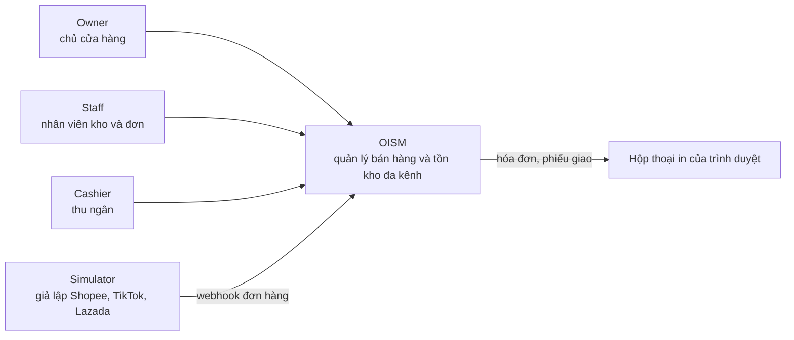
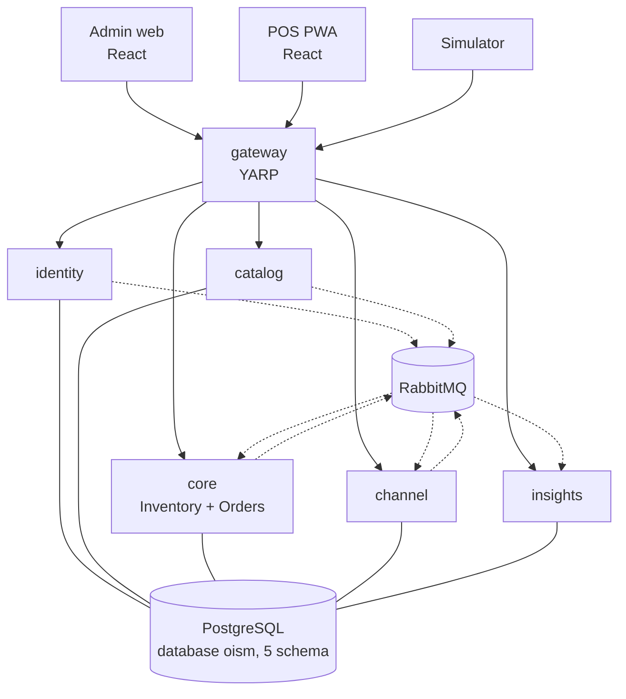

# Bối cảnh hệ thống và các khối chạy

Ba vai trò người dùng và một nguồn webhook giả lập dùng OISM; bên trong, mọi request của người dùng đi qua gateway rồi tới đúng một service.

## Bối cảnh (C4 mức 1)

| Bên ngoài | Quan hệ với OISM |
| --- | --- |
| Owner | Toàn quyền trong tenant của mình: người dùng, chi nhánh, giá, báo cáo lợi nhuận, dự báo |
| Staff | Quản lý sản phẩm, kho, đơn hàng; không xem lợi nhuận |
| Cashier | Chỉ dùng POS |
| Simulator | Gửi webhook đơn hàng giả lập; không có sàn thật nào được gọi |
| Trình duyệt | In hóa đơn và phiếu giao qua Browser Print |

Không có hệ thống ngoài nào khác: không cổng thanh toán, không dịch vụ AI bên ngoài, không dịch vụ email.

## Các khối chạy (C4 mức 2)

Đường liền có mũi tên là HTTP; đường đứt là event qua RabbitMQ; đường liền không mũi tên là kết nối tới schema riêng của service trong database `oism` ([ADR-0013](../decisions/0013-one-database-schema-per-service.md)).

| Khối | Công nghệ | Trách nhiệm | Schema | Nhận từ | Phát ra |
| --- | --- | --- | --- | --- | --- |
| `admin` | React, Vite, TypeScript | Trang quản trị cho Owner và Staff | Không | Người dùng | HTTP tới gateway |
| `pos` | React PWA | Bán tại quầy cho Cashier | Không | Người dùng | HTTP tới gateway |
| `gateway` | ASP.NET Core, YARP | Định tuyến, kiểm JWT, TLS, WebSocket | Không | Frontend, simulator | HTTP tới service |
| `identity` | ASP.NET Core, EF Core | Tenant, user, đăng nhập, chi nhánh | `identity` | HTTP | `BranchUpserted` |
| `catalog` | ASP.NET Core, EF Core | Danh mục, sản phẩm, SKU, mã vạch, giá | `catalog` | HTTP | `SkuUpserted` |
| `core` | ASP.NET Core, EF Core, Hangfire | Ledger, số dư, giá vốn, đơn, giữ hàng, POS checkout | `core` | HTTP, `SkuUpserted`, `BranchUpserted`, `SubmitOrder` | `OrderReserved`, `OrderRejected`, `OrderConfirmed`, `OrderCancelled`, `StockChanged` |
| `channel` | ASP.NET Core, EF Core | Nhận webhook, chống trùng, chuẩn hóa đơn | `channel` | HTTP, `OrderReserved`, `OrderRejected` | `SubmitOrder` |
| `insights` | ASP.NET Core, EF Core, Hangfire, SignalR | Báo cáo, cảnh báo, dự báo, thông báo realtime | `insights` | HTTP, WebSocket, mọi event của `core`, `SkuUpserted` | Thông báo SignalR |

## Địa chỉ và cổng

Đây là quy ước của nhóm để mọi người và mọi công cụ AI dựng ra cùng một cấu hình.

| Khối | Tiền tố qua gateway | Cổng trên máy dev | Tên trong Compose |
| --- | --- | --- | --- |
| `gateway` | Gốc | 8080 (HTTP), 8443 (HTTPS) | `gateway` |
| `identity` | `/api/identity` | 5101 | `identity` |
| `catalog` | `/api/catalog` | 5102 | `catalog` |
| `core` | `/api/core` | 5103 | `core` |
| `channel` | `/api/channel` | 5104 | `channel` |
| `insights` | `/api/insights`, `/hubs/notifications` | 5105 | `insights` |
| `admin` | Không qua gateway | 5173 | `admin` |
| `pos` | Không qua gateway | 5174 | `pos` |
| PostgreSQL | Không | 5432 | `postgres` |
| RabbitMQ | Không | 5672, giao diện quản trị 15672 | `rabbitmq` |

Gateway bỏ tiền tố trước khi chuyển tiếp: `GET /api/core/orders` tới service `core` thành `GET /orders`.

## Quy tắc giao tiếp

- Frontend chỉ gọi gateway. Không ứng dụng nào gọi thẳng cổng của service.
- Service không gọi HTTP sang service khác và không đọc schema của service khác. Dữ liệu cần dùng chung đi bằng event và được lưu thành bản sao cục bộ.
- Mọi event đi qua outbox của bên phát và inbox của bên nhận. Chi tiết ở [messaging.md](messaging.md).
