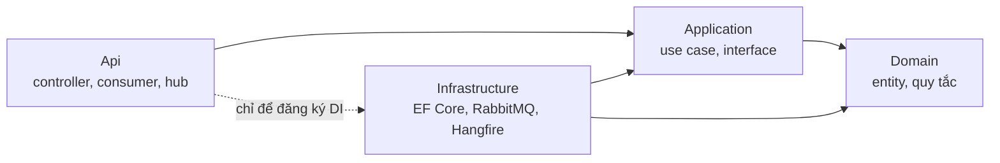

# Phân tầng và phân lớp

Phụ thuộc chỉ đi một chiều: tầng trên gọi tầng dưới, lớp ngoài tham chiếu lớp trong. Vi phạm là lỗi review kể cả khi code chạy được, vì nó phá khả năng kiểm thử nghiệp vụ mà không cần database.

## Năm tầng của hệ thống

| Tầng | Thành phần | Folder | Được gọi tới |
| --- | --- | --- | --- |
| 1. Giao diện | Admin web, POS PWA | `frontend/admin`, `frontend/pos`, `frontend/shared` | Chỉ tầng 2 |
| 2. Cổng vào | API gateway | `backend/gateway` | Chỉ tầng 3 |
| 3. Dịch vụ | identity, catalog, core, channel, insights | `backend/services/*` | Tầng 4 và tầng 5 của chính nó |
| 4. Thông điệp | RabbitMQ, outbox, inbox | `backend/shared` | Tầng 3 của service khác, chỉ bằng event |
| 5. Dữ liệu | PostgreSQL, một database `oism`, mỗi service một schema | `deploy/postgres`, migration trong từng service | Không gọi tầng nào |

## Bốn lớp trong mỗi service

| Lớp | Project | Được tham chiếu | Package được phép |
| --- | --- | --- | --- |
| Domain | `Oism.<Service>.Domain` | Không lớp nào | Chỉ thư viện chuẩn .NET |
| Application | `Oism.<Service>.Application` | Domain, `Oism.Contracts` | FluentValidation, abstraction của logging và DI |
| Infrastructure | `Oism.<Service>.Infrastructure` | Application, Domain, `Oism.BuildingBlocks`, `Oism.Contracts` | EF Core, Npgsql, RabbitMQ.Client, Hangfire, BCrypt |
| Api | `Oism.<Service>.Api` | Application; Infrastructure chỉ để đăng ký DI | ASP.NET Core, Swashbuckle, SignalR |

## Cái gì đặt ở đâu

| Thứ cần viết | Lớp | Ví dụ trong `core` |
| --- | --- | --- |
| Entity, aggregate | Domain | `Order`, `InventoryBalance` |
| Value object | Domain | `Money`, `Quantity` |
| Quy tắc nghiệp vụ thuần | Domain | `WeightedAverageCost.Recalculate`, `OrderStateMachine` |
| Lỗi nghiệp vụ | Domain | `InsufficientStockException`, `InvalidStateTransitionException` |
| Use case | Application | `ReserveStockHandler`, `PosCheckoutHandler` |
| Interface ra ngoài | Application | `IOrderRepository`, `IStockService`, `IEventPublisher`, `IUnitOfWork`, `IClock` |
| Dữ liệu vào và ra của use case | Application | `PosCheckoutCommand`, `OrderDto` |
| Kiểm tra đầu vào | Application | `PosCheckoutValidator` |
| Truy vấn chỉ đọc | Interface ở Application, cài đặt ở Infrastructure | `IStockQueries.SearchForPosAsync` |
| Ánh xạ EF Core, migration | Infrastructure | `CoreDbContext`, `OrderConfiguration` |
| Repository, khóa dòng | Infrastructure | `InventoryBalanceRepository.LockAsync` |
| Outbox, inbox, kết nối RabbitMQ | Infrastructure, dùng lại `Oism.BuildingBlocks` | `OutboxEventPublisher` |
| Job nền | Đăng ký ở Infrastructure, nghiệp vụ ở Application | `ExpireReservationsHandler` |
| Controller, consumer, hub | Api | `OrdersController`, `SubmitOrderConsumer` |
| Đăng ký DI, cấu hình | Api | `Program.cs` |

## Quy tắc cấm

- Domain không tham chiếu EF Core, ASP.NET Core, RabbitMQ hay bất kỳ package hạ tầng nào. Entity không mang attribute của EF Core; ánh xạ nằm ở Infrastructure.
- Application không tham chiếu Infrastructure hay Api và không dùng `DbContext`. Truy cập dữ liệu đi qua interface repository hoặc interface truy vấn.
- Controller và consumer không chứa nghiệp vụ: nhận request, gọi một handler, trả kết quả.
- Một use case là một transaction do handler mở qua `IUnitOfWork`. Không gọi `SaveChanges` rải rác ở nhiều nơi.
- Không dùng `DateTime.UtcNow` trong Domain hay Application; lấy giờ qua `IClock` để test được.
- Quy tắc nghiệp vụ không viết bằng SQL hay trigger, trừ hai hàng rào cuối ở database: CHECK trên số dư và trigger chặn sửa ledger.

## Module bên trong `core`

`core` có hai module, mỗi module một thư mục con trong Domain và Application.

| Module | Chứa | Owner |
| --- | --- | --- |
| Inventory | Số dư, ledger, phiếu nhập, chuyển kho, kiểm kê, giá vốn | Dev A |
| Orders | Đơn, dòng đơn, phần giữ hàng, thanh toán, POS checkout, job hết hạn | Dev B |

Orders đổi tồn qua interface `IStockService` của Inventory (giữ hàng, tiêu thụ phần giữ, giải phóng phần giữ). Orders không tự sửa `InventoryBalance` và không tự ghi ledger. Hai module dùng chung một `CoreDbContext` và một transaction, nên lời gọi qua interface vẫn nguyên tử.

## Ba lớp của frontend

| Lớp | Thư mục | Chứa | Được gọi |
| --- | --- | --- | --- |
| Màn hình | `src/pages` | Route, bố cục màn hình | `features`, `shared` |
| Nghiệp vụ giao diện | `src/features` | Form, bảng, hook theo từng nghiệp vụ | `shared` |
| Dùng chung | `frontend/shared` | API client, auth, kết nối realtime, kiểu dữ liệu | Không gọi lớp nào ở trên |

`admin` và `pos` không tham chiếu lẫn nhau. Giao diện không tự quyết định nghiệp vụ: kiểm tồn ở POS chỉ để báo sớm, backend mới là nơi quyết định.
