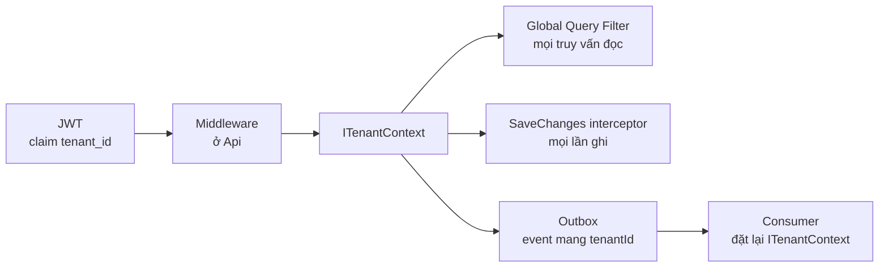

# Đa tenant và cách ly dữ liệu

Mọi service dùng chung một cơ chế: `TenantId` lấy từ JWT, vào `ITenantContext`, rồi được EF Core tự áp lên mọi truy vấn đọc và mọi lần ghi. Dev không tự viết `WHERE tenant_id = ...`; cơ chế làm việc đó, nên chỗ nào đi vòng qua cơ chế mới là chỗ dễ rò dữ liệu.

Mô hình: các tenant dùng chung bảng, mọi bảng nghiệp vụ có cột `tenant_id` ([ADR-0002](../decisions/0002-shared-schema-tenant-id.md)). Schema của PostgreSQL chia theo service, không chia theo tenant ([ADR-0013](../decisions/0013-one-database-schema-per-service.md)).

## Đường đi của TenantId

| Mảnh | Nằm ở | Việc làm |
| --- | --- | --- |
| `ITenantContext` | `Oism.BuildingBlocks/Tenancy` | Giữ `TenantId` của request hoặc của event đang xử lý |
| Middleware | `Oism.BuildingBlocks/Tenancy` | Đọc claim `tenant_id` từ JWT đã kiểm, đặt vào `ITenantContext` |
| `ITenantOwned` | `Oism.BuildingBlocks/Persistence` | Interface đánh dấu entity có `TenantId` |
| Global Query Filter | DbContext base | Tự thêm điều kiện `TenantId == tenant hiện tại` cho mọi entity `ITenantOwned` |
| Interceptor khi ghi | DbContext base | Gán `TenantId` cho bản ghi mới; ném lỗi nếu bản ghi mang `TenantId` khác tenant hiện tại |

## Quy tắc

1. Mọi entity nghiệp vụ cài `ITenantOwned`. Bảng không có `tenant_id` chỉ gồm `tenants` và các bảng hạ tầng (Hangfire).
2. Mọi unique index và mọi chỉ mục tra cứu bắt đầu bằng `tenant_id`.
3. ID do client gửi lên luôn được tra qua repository có filter. ID của tenant khác vì thế trả về "không tìm thấy" và API trả 404, không trả 403, để không lộ việc bản ghi có tồn tại.
4. Khi nối hai bản ghi (đơn với chi nhánh, dòng đơn với SKU), cả hai phải được tra trong cùng tenant context. Không tin `tenantId` nằm trong body request.
5. Event luôn mang `tenantId`. Consumer đặt `ITenantContext` từ event trước khi chạm vào database.
6. SignalR chỉ gửi vào group `tenant:{tenantId}` hoặc `tenant:{tenantId}:branch:{branchId}`. Không gửi cho tất cả kết nối.
7. Khóa cache, nếu có, bắt đầu bằng `tenantId`.

## Những chỗ được phép bỏ filter

`IgnoreQueryFilters` chỉ được dùng trong đúng các phương thức sau. Chỗ nào khác dùng nó là lỗi.

| Service | Phương thức | Vì sao chưa có tenant | Sau đó |
| --- | --- | --- | --- |
| identity | Tìm user theo email hoặc số điện thoại khi đăng nhập | Người dùng chưa có token | Lấy `TenantId` từ user tìm được |
| identity | Tìm refresh token theo giá trị băm | Token cũ đã hết hạn | Lấy `TenantId` từ bản ghi token |
| channel | Tìm `ChannelShop` theo kênh và mã shop | Webhook không mang JWT | Đặt tenant context theo shop |
| core | Job tìm phần giữ hàng đã hết hạn của mọi tenant | Job chạy không gắn request | Xử lý từng đơn trong tenant context của đơn đó |
| insights | Job tổng hợp ngày và job dự báo | Job chạy không gắn request | Lặp qua từng tenant, mỗi vòng một tenant context |
| mọi service | Tiến trình đẩy outbox | Bảng outbox là hạ tầng | Không đọc bảng nghiệp vụ |

## Kiểm thử

- T14: tenant A dùng ID đơn, SKU, chi nhánh của tenant B trên mọi API đọc và ghi; kết quả phải là 404 và không có quan hệ chéo nào được tạo.
- T15: phiên SignalR của tenant B không nhận thông báo của tenant A.
- Mỗi service có một test tự động duyệt mọi entity của DbContext và báo lỗi nếu entity nghiệp vụ nào không cài `ITenantOwned`.
- Bộ test toàn hệ thống ở task W5-02 phủ thêm event và job.
