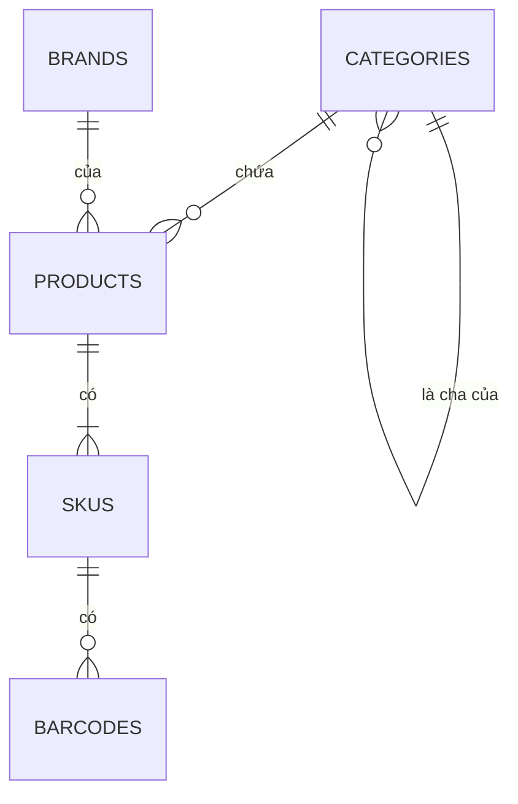

# Mô hình dữ liệu: catalog

Database `oism_catalog` giữ danh mục, thương hiệu, sản phẩm, SKU, mã vạch và giá niêm yết. Giá vốn không nằm ở đây; nó thuộc `core`.

## categories và brands

| Bảng | Cột | Ràng buộc |
| --- | --- | --- |
| `categories` | `id`, `tenant_id`, `parent_id` (cho phép null), `name`, `sort_order` | Unique `(tenant_id, parent_id, name)`; `parent_id` không được là chính nó hay con cháu của nó, kiểm ở Domain |
| `brands` | `id`, `tenant_id`, `name` | Unique `(tenant_id, name)` |

## products

| Cột | Kiểu | Ghi chú |
| --- | --- | --- |
| `id` | uuid | Khóa chính |
| `tenant_id` | uuid | |
| `category_id` | uuid | |
| `brand_id` | uuid, cho phép null | |
| `name` | text | |
| `description` | text, cho phép null | |
| `has_variants` | boolean | False thì sản phẩm có đúng một SKU |
| `is_active` | boolean | |

## skus

| Cột | Kiểu | Ghi chú |
| --- | --- | --- |
| `id` | uuid | Khóa chính; chính là `SkuId` dùng ở mọi service |
| `tenant_id`, `product_id` | uuid | |
| `sku_code` | text | Unique `(tenant_id, sku_code)` |
| `attributes` | jsonb | Ví dụ `{"color":"Đen","size":"M"}`; rỗng với sản phẩm đơn |
| `retail_price` | numeric(18,4) | Không âm |
| `wholesale_price` | numeric(18,4) | Không âm |
| `is_active` | boolean | |
| `version` | bigint | Tăng 1 mỗi lần SKU, mã vạch hoặc giá của nó đổi; đi kèm `SkuUpserted` |

Tên hiển thị của SKU là tên sản phẩm kèm các giá trị thuộc tính, ví dụ "Áo thun A, Đen, M". Tên này được dựng ở `catalog` và gửi trong `SkuUpserted`.

## barcodes

| Cột | Kiểu | Ghi chú |
| --- | --- | --- |
| `id` | uuid | Khóa chính |
| `tenant_id`, `sku_id` | uuid | |
| `code` | text | Unique `(tenant_id, code)` |
| `symbology` | text | `EAN13`, `Code128` |

EAN-13 tự sinh dùng tiền tố lưu hành nội bộ 200, 9 chữ số tăng dần theo tenant và một số kiểm tra. EAN-13 nhập tay phải qua kiểm số kiểm tra.

## Bảng hạ tầng

`outbox_messages` có cùng cấu trúc như ở [core](core.md). `catalog` không nhận event nên không có `inbox_messages`.
