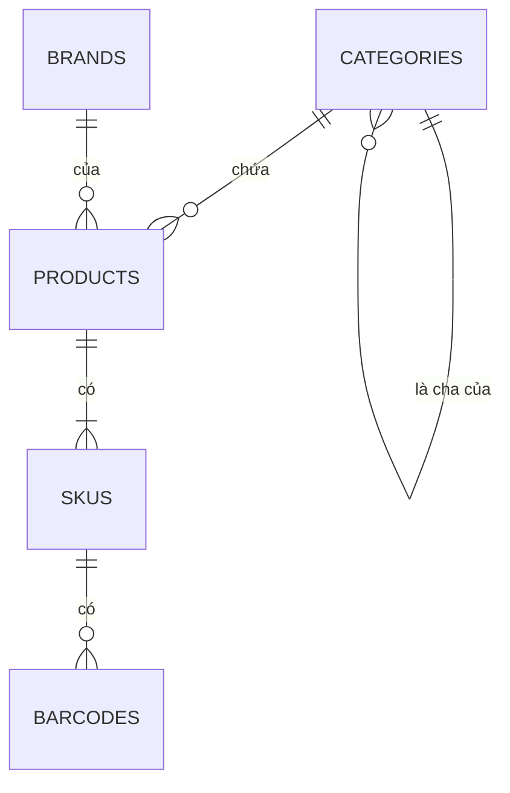

# Mô hình dữ liệu: catalog

Schema `catalog` của database `oism` giữ danh mục, thương hiệu, sản phẩm, SKU, mã vạch và giá niêm yết. Giá vốn không nằm ở đây; nó thuộc `core`.

## categories và brands

| Bảng | Cột | Ràng buộc |
| --- | --- | --- |
| `categories` | `id`, `tenant_id`, `parent_id` (cho phép null), `name`, `sort_order` (mặc định 0) | Unique `(tenant_id, parent_id, name)` với `NULLS NOT DISTINCT`, để hai danh mục gốc cùng tên cũng bị coi là trùng; khóa ngoại `parent_id` tới `categories.id`, không cho xóa cha còn con; `parent_id` không được là chính nó hay con cháu của nó, kiểm ở Domain |
| `brands` | `id`, `tenant_id`, `name` | Unique `(tenant_id, name)` |

## products

| Cột | Kiểu | Ghi chú |
| --- | --- | --- |
| `id` | uuid | Khóa chính |
| `tenant_id` | uuid | |
| `category_id` | uuid | |
| `brand_id` | uuid, cho phép null | |
| `name` | text | |
| `description` | text, cho phép null | |
| `has_variants` | boolean | False thì sản phẩm có đúng một SKU |
| `is_active` | boolean | Tắt thì mọi SKU của sản phẩm coi như ngừng bán |

Khóa ngoại `category_id` tới `categories.id` và `brand_id` tới `brands.id`, đều không cho xóa bản ghi còn được tham chiếu.

## skus

| Cột | Kiểu | Ghi chú |
| --- | --- | --- |
| `id` | uuid | Khóa chính; chính là `SkuId` dùng ở mọi service |
| `tenant_id`, `product_id` | uuid | |
| `sku_code` | text | Unique `(tenant_id, sku_code)` |
| `attributes` | jsonb | Ví dụ `{"color":"Đen","size":"M"}`; `{}` với sản phẩm đơn |
| `retail_price` | numeric(18,4) | Không âm |
| `wholesale_price` | numeric(18,4) | Không âm |
| `is_active` | boolean | |
| `version` | bigint | Bắt đầu từ 1; tăng 1 mỗi lần SKU, mã vạch hoặc giá của nó đổi, và mỗi lần tên hoặc `is_active` của sản phẩm đổi; đi kèm `SkuUpserted` |

Ràng buộc: khóa ngoại `product_id` tới `products.id`; CHECK `ck_skus_prices_not_negative` (`retail_price >= 0 AND wholesale_price >= 0`).

Tên hiển thị của SKU là tên sản phẩm kèm các giá trị thuộc tính, ví dụ "Áo thun A, Đen, M". Tên này được dựng ở `catalog` và gửi trong `SkuUpserted`. `jsonb` không giữ thứ tự khóa, nên các giá trị được xếp theo tên thuộc tính (`color` trước `size`), không theo thứ tự gửi lên.

Trạng thái bán gửi trong `SkuUpserted` là `skus.is_active` và `products.is_active` cùng bật. Mọi thay đổi của SKU, mã vạch và giá khóa dòng sản phẩm bằng `FOR UPDATE`, để `version` tăng đúng từng bước.

## barcodes

| Cột | Kiểu | Ghi chú |
| --- | --- | --- |
| `id` | uuid | Khóa chính |
| `tenant_id`, `sku_id` | uuid | |
| `code` | text | Unique `(tenant_id, code)` |
| `symbology` | text | `EAN13`, `Code128` |

Khóa ngoại `sku_id` tới `skus.id`, xóa SKU thì xóa mã vạch của nó.

EAN-13 tự sinh dùng tiền tố lưu hành nội bộ 200, 9 chữ số tăng dần theo tenant và một số kiểm tra. Số kế tiếp là số lớn nhất trong các mã EAN-13 mang tiền tố 200 của tenant cộng 1 (bắt đầu từ 1); việc lấy số giữ một advisory lock theo tenant tới hết transaction, nên hai request cùng lúc không nhận cùng một mã. EAN-13 nhập tay phải qua kiểm số kiểm tra. Code128 là chuỗi chữ và số không dấu, tối đa 48 ký tự.

## Bảng hạ tầng

`outbox_messages` có cùng cấu trúc như ở [core](core.md), tạo cùng migration với `products`. `catalog` không nhận event nên không có `inbox_messages`.
