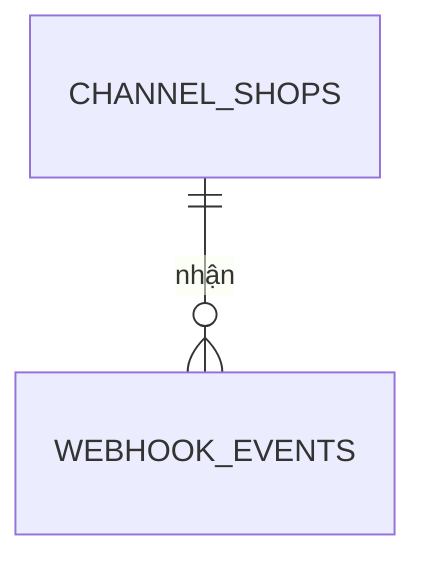

# Mô hình dữ liệu: channel

Schema `channel` của database `oism` giữ cấu hình shop của từng sàn và nhật ký webhook đã nhận. `channel` không giữ đơn hàng; đơn nằm ở `core`.

## channel_shops

Ánh xạ một shop trên sàn sang tenant và chi nhánh, vì webhook không mang JWT.

| Cột | Kiểu | Ghi chú |
| --- | --- | --- |
| `id` | uuid | Khóa chính |
| `tenant_id` | uuid | |
| `channel` | text | `Shopee`, `TikTok`, `Lazada` |
| `shop_id` | text | Mã shop do sàn cấp; unique `(channel, shop_id)` trên toàn hệ thống |
| `branch_id` | uuid | Chi nhánh xuất hàng cho đơn của shop |
| `secret` | text | Khóa để kiểm chữ ký HMAC giả lập |
| `is_active` | boolean | |

Tra `channel_shops` theo `(channel, shop_id)` là một trong các chỗ được phép bỏ filter tenant ([multi-tenancy.md](../../architecture/multi-tenancy.md)).

## webhook_events

| Cột | Kiểu | Ghi chú |
| --- | --- | --- |
| `id` | uuid | Khóa chính |
| `tenant_id` | uuid | |
| `channel` | text | |
| `event_id` | text | Mã sự kiện do sàn cấp; unique `(tenant_id, channel, event_id)` |
| `external_order_id` | text | Mã đơn của sàn |
| `payload` | jsonb | Nguyên văn body đã nhận |
| `status` | text | `Received`, `Submitted`, `Reserved`, `Rejected`, `Failed` |
| `reason` | text, cho phép null | Lý do khi `Rejected` hoặc `Failed` |
| `order_id` | uuid, cho phép null | Đơn ở `core` khi `Reserved` |
| `received_at`, `updated_at` | timestamptz | |

Chỉ mục: `(tenant_id, received_at)`; `(tenant_id, channel, external_order_id)`.

## Bảng hạ tầng

`outbox_messages` và `inbox_messages` có cùng cấu trúc như ở [core](core.md).
