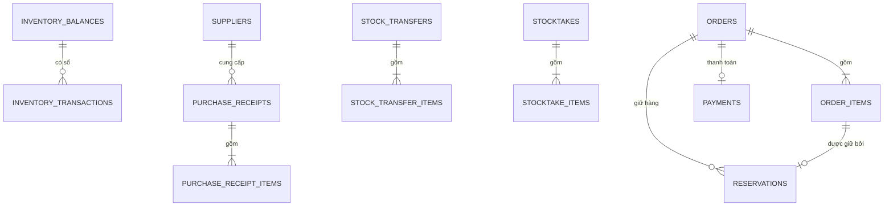

# Mô hình dữ liệu: core

Schema `core` của database `oism` giữ số dư tồn, sổ giao dịch, chứng từ kho và đơn hàng. Hai bảng quyết định tính đúng của cả hệ thống là `inventory_balances` và `inventory_transactions`; quy tắc đổi chúng nằm ở [transactions-and-concurrency.md](../../architecture/transactions-and-concurrency.md).

## inventory_balances

Một dòng cho mỗi SKU tại mỗi chi nhánh. Đây là đối tượng bị khóa khi giữ hàng và khi đổi tồn.

| Cột | Kiểu | Ghi chú |
| --- | --- | --- |
| `tenant_id` | uuid | Khóa chính, phần 1 |
| `branch_id` | uuid | Khóa chính, phần 2 |
| `sku_id` | uuid | Khóa chính, phần 3 |
| `on_hand` | integer | Tồn thực tế theo sổ |
| `reserved` | integer | Tổng phần giữ hàng đang Active |
| `avg_cost` | numeric(18,4) | Giá vốn bình quân tại chi nhánh |
| `reorder_threshold` | integer, cho phép null | Ngưỡng cảnh báo; null là không cảnh báo |
| `version` | bigint | Tăng 1 mỗi lần dòng đổi; đi kèm `StockChanged` |
| `updated_at` | timestamptz | |

Ràng buộc: `CHECK (on_hand >= 0 AND reserved >= 0 AND reserved <= on_hand)`. Tồn khả dụng không lưu; tính bằng `on_hand - reserved`.

## inventory_transactions

Sổ giao dịch chỉ thêm mới. Trigger chặn `UPDATE` và `DELETE`.

| Cột | Kiểu | Ghi chú |
| --- | --- | --- |
| `seq` | bigint identity | Khóa chính; thứ tự ghi |
| `id` | uuid | Unique; dùng để tham chiếu từ ngoài |
| `tenant_id`, `branch_id`, `sku_id` | uuid | |
| `type` | text | `IN` hoặc `OUT` |
| `reason` | text | `Purchase`, `Sale`, `TransferOut`, `TransferIn`, `StocktakeAdjust`, `ReturnIn`, `Reversal` |
| `quantity` | integer | Luôn dương |
| `balance_after` | integer | `on_hand` sau giao dịch, tính dưới khóa |
| `unit_cost` | numeric(18,4) | Đơn giá của giao dịch: giá nhập, hoặc giá vốn lúc xuất |
| `reference_type` | text | `PurchaseReceipt`, `Order`, `StockTransfer`, `Stocktake` |
| `reference_id` | uuid | Chứng từ nguồn |
| `reversal_of_id` | uuid, cho phép null | Dòng bị bù trừ |
| `created_by` | uuid, cho phép null | Null khi do job hệ thống |
| `created_at` | timestamptz | |

Chỉ mục: `(tenant_id, created_at)`; `(tenant_id, branch_id, sku_id, seq)`; `(tenant_id, reference_type, reference_id)`.

## orders

| Cột | Kiểu | Ghi chú |
| --- | --- | --- |
| `id` | uuid | Khóa chính |
| `tenant_id`, `branch_id` | uuid | |
| `order_number` | text | Mã hiển thị, unique theo tenant |
| `channel` | text | `POS`, `Admin`, `Shopee`, `TikTok`, `Lazada` |
| `external_order_id` | text, cho phép null | Mã đơn của sàn |
| `idempotency_key` | text, cho phép null | Chỉ đơn POS |
| `status` | text | `Draft`, `Reserved`, `Confirmed`, `Completed`, `Cancelled` |
| `total_amount` | numeric(18,4) | Tổng `quantity × unit_price − discount` |
| `reserved_until` | timestamptz, cho phép null | Hạn giữ hàng |
| `confirmed_at`, `completed_at`, `cancelled_at` | timestamptz, cho phép null | |
| `cancel_reason` | text, cho phép null | `Manual` hoặc `Expired` |
| `note` | text, cho phép null | |
| `created_by` | uuid, cho phép null | Null với đơn từ sàn |
| `created_at` | timestamptz | |

Unique: `(tenant_id, order_number)`; `(tenant_id, channel, external_order_id)` khi `external_order_id` khác null; `(tenant_id, idempotency_key)` khi khác null. Chỉ mục: `(tenant_id, created_at)`; `(tenant_id, status, reserved_until)` cho job hết hạn.

## order_items

| Cột | Kiểu | Ghi chú |
| --- | --- | --- |
| `id` | uuid | Khóa chính |
| `tenant_id`, `order_id`, `sku_id` | uuid | |
| `sku_code`, `sku_name` | text | Chụp lại lúc tạo đơn |
| `quantity` | integer | Dương |
| `unit_price` | numeric(18,4) | Giá bán lúc tạo đơn |
| `discount` | numeric(18,4) | Giảm giá của dòng, mặc định 0 |
| `cost_price` | numeric(18,4), cho phép null | Ghi một lần lúc xác nhận; sau đó không đổi |

Chỉ mục: `(tenant_id, order_id)`; `(tenant_id, sku_id)`.

## reservations

| Cột | Kiểu | Ghi chú |
| --- | --- | --- |
| `id` | uuid | Khóa chính |
| `tenant_id`, `order_id`, `order_item_id`, `branch_id`, `sku_id` | uuid | |
| `quantity` | integer | Dương |
| `status` | text | `Active`, `Consumed`, `Released` |
| `expires_at` | timestamptz | |
| `created_at`, `closed_at` | timestamptz | `closed_at` null khi còn Active |

Chỉ mục: `(tenant_id, order_id)`; `(status, expires_at)` cho job hết hạn quét mọi tenant.

## Chứng từ kho và bảng phụ

| Bảng | Cột chính | Ràng buộc |
| --- | --- | --- |
| `payments` | `id`, `tenant_id`, `order_id`, `method` (`Cash`, `QR`), `amount`, `confirmed_by`, `confirmed_at` | Unique `(tenant_id, order_id)` |
| `suppliers` | `id`, `tenant_id`, `name`, `phone`, `is_active` | |
| `purchase_receipts` | `id`, `tenant_id`, `branch_id`, `supplier_id`, `receipt_number`, `status` (`Draft`, `Confirmed`), `note`, `confirmed_at`, `confirmed_by`, `created_at` | Unique `(tenant_id, receipt_number)` |
| `purchase_receipt_items` | `id`, `tenant_id`, `receipt_id`, `sku_id`, `quantity`, `unit_cost` | `quantity > 0`, `unit_cost >= 0` |
| `stock_transfers` | `id`, `tenant_id`, `from_branch_id`, `to_branch_id`, `transfer_number`, `status` (`Draft`, `InTransit`, `Received`), `shipped_at`, `received_at`, `created_by` | `from_branch_id <> to_branch_id` |
| `stock_transfer_items` | `id`, `tenant_id`, `transfer_id`, `sku_id`, `quantity`, `unit_cost` | `unit_cost` ghi lúc xuất |
| `stocktakes` | `id`, `tenant_id`, `branch_id`, `status` (`Open`, `Posted`), `created_by`, `posted_at` | |
| `stocktake_items` | `id`, `tenant_id`, `stocktake_id`, `sku_id`, `counted_qty`, `system_qty`, `difference` | `system_qty` và `difference` ghi lúc chốt; unique `(stocktake_id, sku_id)` |
| `sku_refs` | `tenant_id`, `sku_id`, `sku_code`, `name`, `barcodes` (mảng text), `retail_price`, `wholesale_price`, `is_active`, `version` | Khóa chính `(tenant_id, sku_id)`; unique `(tenant_id, sku_code)` |
| `branch_refs` | `tenant_id`, `branch_id`, `code`, `name`, `type`, `is_active`, `version` | Khóa chính `(tenant_id, branch_id)` |
| `outbox_messages` | `id`, `tenant_id`, `type`, `payload` (jsonb), `occurred_at`, `processed_at`, `attempts` | Chỉ mục trên `processed_at` khi null |
| `inbox_messages` | `event_id`, `type`, `processed_at` | Khóa chính `event_id` |

`sku_refs` và `branch_refs` là bản sao dựng từ event. Chỉ consumer được ghi vào hai bảng này, và chỉ ghi đè khi `version` của event lớn hơn `version` đang lưu.

Bảng của Hangfire nằm trong schema riêng `hangfire_core` và không có `tenant_id`.
