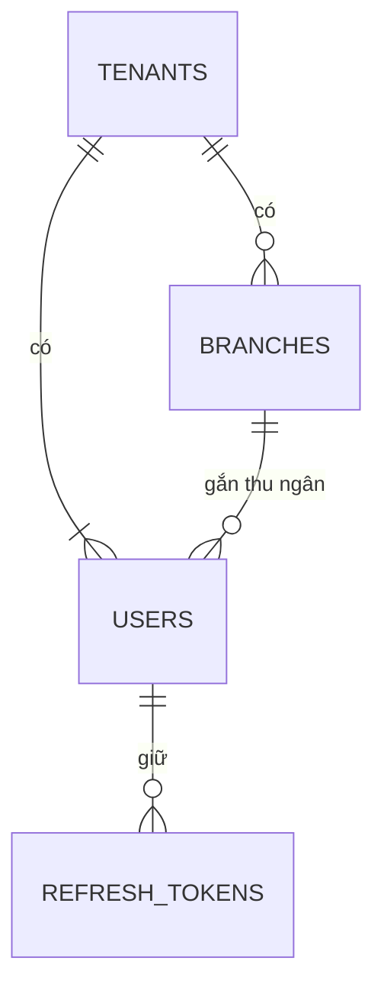

# Mô hình dữ liệu: identity

Schema `identity` của database `oism` giữ tenant, người dùng, refresh token và chi nhánh. Bảng `tenants` là bảng duy nhất không có `tenant_id`.

## tenants

| Cột | Kiểu | Ghi chú |
| --- | --- | --- |
| `id` | uuid | Khóa chính; chính là `TenantId` |
| `name` | text | |
| `status` | text | `Active`, `Suspended` |
| `created_at` | timestamptz | |

## users

| Cột | Kiểu | Ghi chú |
| --- | --- | --- |
| `id` | uuid | Khóa chính; chính là `UserId` |
| `tenant_id` | uuid | |
| `full_name` | text | |
| `email` | text, cho phép null | Unique trên toàn hệ thống, so khớp không phân biệt hoa thường |
| `phone` | text, cho phép null | Unique trên toàn hệ thống |
| `password_hash` | text | BCrypt |
| `role` | text | `Owner`, `Staff`, `Cashier` |
| `branch_id` | uuid, cho phép null | Bắt buộc với Cashier |
| `is_active` | boolean | |
| `created_at` | timestamptz | |

Ràng buộc: ít nhất một trong `email`, `phone` khác null. Email và số điện thoại unique toàn cục vì lúc đăng nhập chưa biết tenant ([ADR-0011](../../decisions/0011-auth-and-roles.md)).

## refresh_tokens

| Cột | Kiểu | Ghi chú |
| --- | --- | --- |
| `id` | uuid | Khóa chính |
| `tenant_id`, `user_id` | uuid | |
| `token_hash` | text | SHA-256 của token; unique |
| `expires_at` | timestamptz | 7 ngày sau khi cấp |
| `revoked_at` | timestamptz, cho phép null | |
| `replaced_by_id` | uuid, cho phép null | Token mới sau khi xoay vòng |
| `created_at` | timestamptz | |

## branches

| Cột | Kiểu | Ghi chú |
| --- | --- | --- |
| `id` | uuid | Khóa chính; chính là `BranchId` |
| `tenant_id` | uuid | |
| `code` | text | Unique `(tenant_id, code)` |
| `name` | text | |
| `type` | text | `Store`, `Warehouse` |
| `address` | text, cho phép null | |
| `is_active` | boolean | |
| `version` | bigint | Tăng 1 mỗi lần sửa; đi kèm `BranchUpserted` |

## Bảng hạ tầng

`outbox_messages` có cùng cấu trúc như ở [core](core.md). `identity` không nhận event nên không có `inbox_messages`.
