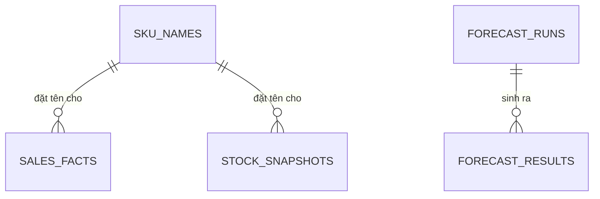

# Mô hình dữ liệu: insights

Database `oism_insights` chỉ chứa bảng đọc dựng từ event. Không bảng nào ở đây là nguồn chuẩn của nghiệp vụ; xóa sạch rồi phát lại event phải dựng lại được.

## sales_facts

Một dòng cho mỗi dòng đơn đã xác nhận, dựng từ `OrderConfirmed`.

| Cột | Kiểu | Ghi chú |
| --- | --- | --- |
| `order_item_id` | uuid | Khóa chính; chặn cộng đôi khi event tới lại |
| `tenant_id`, `order_id`, `branch_id`, `sku_id` | uuid | |
| `channel` | text | |
| `quantity` | integer | |
| `revenue` | numeric(18,4) | `quantity × unit_price − discount` |
| `cogs` | numeric(18,4) | `quantity × cost_price` |
| `confirmed_at` | timestamptz | Mốc ghi nhận |

Chỉ mục: `(tenant_id, confirmed_at)`; `(tenant_id, sku_id, confirmed_at)`; `(tenant_id, branch_id, confirmed_at)`.

## stock_snapshots

Trạng thái tồn mới nhất của mỗi SKU tại mỗi chi nhánh, dựng từ `StockChanged`.

| Cột | Kiểu | Ghi chú |
| --- | --- | --- |
| `tenant_id`, `branch_id`, `sku_id` | uuid | Khóa chính |
| `on_hand`, `reserved`, `available` | integer | |
| `avg_cost` | numeric(18,4) | |
| `threshold` | integer, cho phép null | |
| `version` | bigint | Chỉ ghi đè khi `version` của event lớn hơn |
| `updated_at` | timestamptz | |

Cảnh báo tồn thấp là các dòng có `threshold` khác null và `available <= threshold`.

## Các bảng còn lại

| Bảng | Cột chính | Ràng buộc |
| --- | --- | --- |
| `daily_aggregates` | `tenant_id`, `date`, `branch_id`, `channel`, `sku_id`, `quantity`, `revenue`, `cogs` | Khóa chính là năm cột đầu; `date` cắt theo giờ Việt Nam |
| `sku_names` | `tenant_id`, `sku_id`, `sku_code`, `name`, `version` | Khóa chính `(tenant_id, sku_id)`; dựng từ `SkuUpserted` |
| `forecast_runs` | `id`, `tenant_id`, `ran_at`, `method`, `status` (`Succeeded`, `Failed`), `error`, `baseline_wape`, `forecast_wape` | |
| `forecast_results` | `run_id`, `tenant_id`, `branch_id`, `sku_id`, `has_enough_data`, `daily_level`, `forecast_qty`, `suggested_reorder_qty` | Khóa chính `(run_id, branch_id, sku_id)` |
| `inbox_messages` | `event_id`, `type`, `processed_at` | Khóa chính `event_id` |

`daily_aggregates` do job đêm dựng lại từ `sales_facts` cho từng ngày; chạy lại cho cùng ngày thì ghi đè, không cộng dồn. Báo cáo doanh thu đọc `daily_aggregates` cho các ngày đã tổng hợp và `sales_facts` cho ngày hiện tại.

`insights` không phát event nên không có `outbox_messages`. Bảng của Hangfire nằm trong schema riêng `hangfire`.
