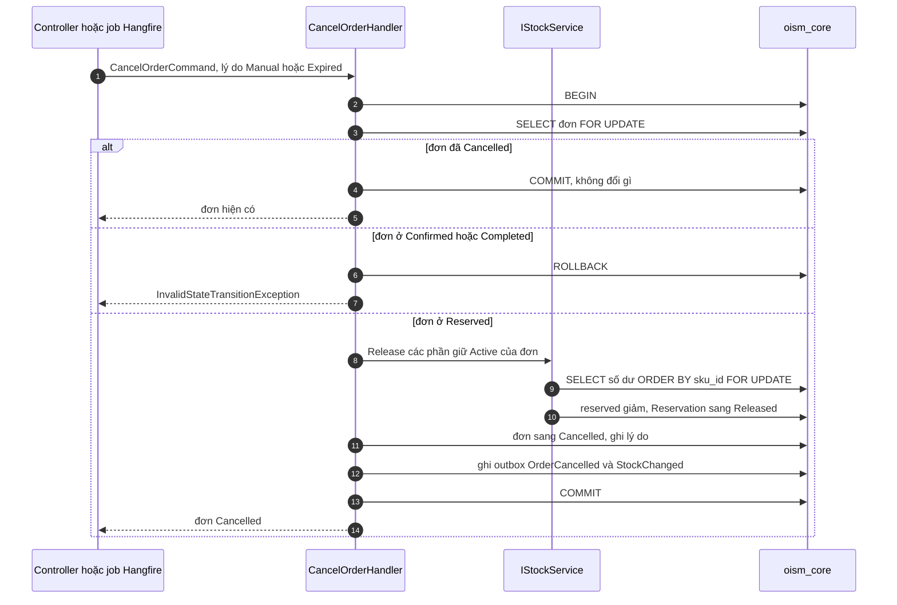

# Luồng: hủy đơn và hết hạn giữ hàng

Hủy tay và hết hạn dùng chung một handler: khóa đơn, giải phóng các phần giữ còn Active, đặt đơn sang Cancelled. Khác nhau duy nhất là lý do và người gọi. Use case [UC-ORD-04](../../usecase-userstory/orders.md) và UC-ORD-05; API `POST /api/core/orders/:id/cancel`.

## Job hết hạn

Job Hangfire `ExpireReservations` chạy mỗi phút.

1. Tìm các đơn ở Reserved có `reserved_until` nhỏ hơn giờ hiện tại, trên mọi tenant. Đây là một trong các chỗ được phép bỏ filter tenant ([multi-tenancy.md](../../architecture/multi-tenancy.md)).
2. Với mỗi đơn: đặt tenant context theo `tenant_id` của đơn, rồi gọi `CancelOrderHandler` với lý do Expired. Mỗi đơn một transaction.
3. Một đơn lỗi thì ghi log và đi tiếp đơn sau.

Job chỉ đọc danh sách mà không khóa; việc khóa và kiểm lại trạng thái nằm trong handler. Nhờ vậy đơn vừa được duyệt giữa lúc job đọc và lúc job xử lý sẽ bị bỏ qua.

## Mỗi bước đổi gì

| Bước | Khóa | Số dư | Sổ | Outbox |
| --- | --- | --- | --- | --- |
| Khóa đơn | Dòng `orders` | | | |
| Khóa số dư | Các dòng `inventory_balances` của đơn, theo `sku_id` | | | |
| Giải phóng | | `reserved` giảm đúng bằng tổng phần giữ Active, `version` tăng | Không ghi | |
| Kết thúc | | | | `OrderCancelled`, `StockChanged` |

## Trường hợp biên

- Hủy hai lần, hoặc job chạy lại: lần sau thấy đơn đã Cancelled và không làm gì. Không có phần giữ Active nào còn lại để giải phóng lần hai.
- Hủy đơn Confirmed hoặc Completed: trả 409. Không có luồng trả hàng ([ADR-0005](../../decisions/0005-order-lifecycle-and-transactions.md)).
- Job gặp đơn đang được nhân viên duyệt: ai khóa được dòng đơn trước thì thắng.

## Kiểm thử

T06 (hủy hai lần, job chạy lại), T07 (duyệt đúng lúc job chạy), T08 (hủy sau Confirmed).
