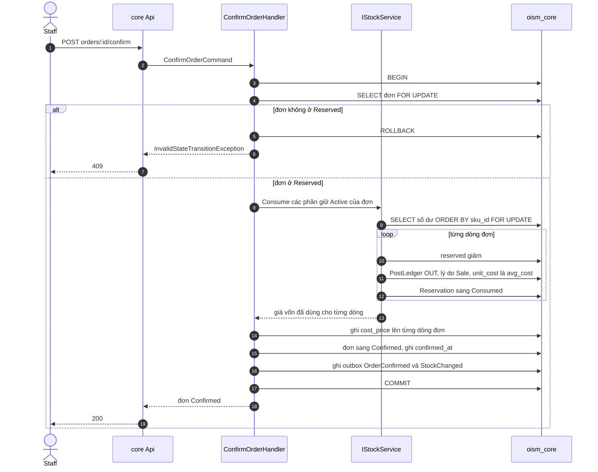

# Luồng: xác nhận đơn

Duyệt đơn là lúc hàng rời kho: một transaction trừ `on_hand`, trừ `reserved`, chốt giá vốn lên từng dòng đơn và ghi sổ. Use case [UC-ORD-03](../../usecase-userstory/orders.md); API `POST /api/core/orders/:id/confirm`; quyết định [ADR-0005](../../decisions/0005-order-lifecycle-and-transactions.md).

## Mỗi bước đổi gì

| Bước | Khóa | Số dư | Sổ | Outbox |
| --- | --- | --- | --- | --- |
| Khóa đơn | Dòng `orders` | | | |
| Khóa số dư | Các dòng `inventory_balances` của đơn, theo `sku_id` | | | |
| Mỗi dòng đơn | | `on_hand` giảm, `reserved` giảm, `version` tăng | Một dòng OUT, `reason = Sale`, `unit_cost` là `avg_cost` lúc này | |
| Chốt giá vốn | | | | |
| Kết thúc | | | | `OrderConfirmed` kèm `costPrice` từng dòng, `StockChanged` |

Tồn khả dụng không đổi qua bước này: hàng đã bị loại khỏi tồn khả dụng từ lúc giữ. Chỉ trừ `on_hand` mà quên trừ `reserved` sẽ làm hệ thống giữ thừa hàng.

## Trường hợp biên

- Job hết hạn chạy cùng lúc: cả hai cùng khóa dòng đơn. Bên khóa được trước đổi trạng thái; bên sau thấy đơn không còn ở Reserved và dừng.
- `avg_cost` đọc sau khi khóa số dư, nên một phiếu nhập xác nhận ngay trước đó đã được tính vào.
- `cost_price` ghi đúng một lần. Không có use case nào cập nhật lại trường này.
- Lỗi ở bất kỳ bước nào: rollback toàn bộ; đơn vẫn ở Reserved và phần giữ vẫn Active.

## Kiểm thử

T05 (lỗi khi ghi sổ thì không gì thay đổi), T07 (duyệt đúng lúc job hết hạn chạy), T08 (hủy sau Confirmed bị từ chối), T10 (giá vốn của đơn cũ không đổi).
