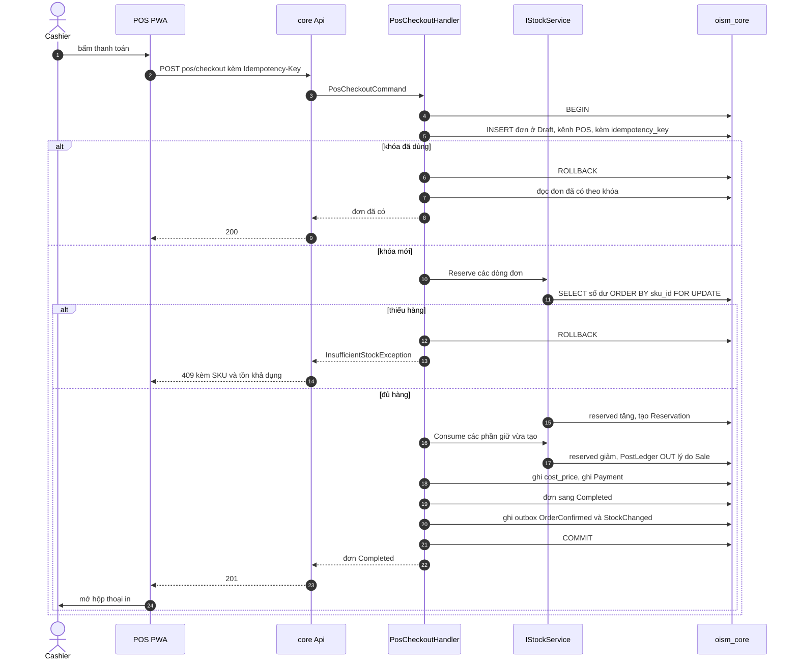

# Luồng: POS checkout

Thanh toán tại quầy chạy toàn bộ chuỗi tạo đơn, giữ hàng, xác nhận, ghi thanh toán và hoàn tất trong một transaction (FR-POS-04). Hoặc mọi thứ được lưu, hoặc không gì được lưu. Use case [UC-POS-02](../../usecase-userstory/pos.md); API `POST /api/core/pos/checkout`; giao diện ở [ui/pos.md](../ui/pos.md).

## Mỗi bước đổi gì

| Bước | Khóa | Số dư | Sổ | Outbox |
| --- | --- | --- | --- | --- |
| Chèn đơn | Unique `(tenant_id, idempotency_key)` chặn gửi trùng | | | |
| Khóa số dư | Các dòng `inventory_balances` của giỏ, theo `sku_id` | | | |
| Giữ rồi tiêu thụ | | `on_hand` giảm; `reserved` tăng rồi giảm về như cũ; `version` tăng | Một dòng OUT, `reason = Sale` cho mỗi dòng đơn | |
| Thanh toán | | | | |
| Kết thúc | | | | `OrderConfirmed`, `StockChanged`; không phát `OrderReserved` |

Đơn đi qua Reserved, Confirmed rồi Completed bên trong transaction. Bên ngoài chỉ thấy đơn ở Completed với đủ `confirmed_at` và `completed_at`.

## Vì sao phải kiểm lại ở backend

Tồn khả dụng POS hiển thị lúc chọn hàng có thể đã cũ khi bấm thanh toán: một đơn online vừa giữ đơn vị cuối, hoặc quầy bên cạnh vừa bán. Bước khóa và kiểm trong transaction là nơi duy nhất quyết định. Hàng đang giữ cho đơn online nằm trong `reserved` nên không bao giờ bị POS bán mất.

## Trường hợp biên

- Bấm hai lần hoặc mạng gửi lại: cùng `Idempotency-Key`, lần sau nhận lại đúng đơn đã tạo. Hai request đồng thời cùng khóa thì request thua bị chặn ở unique, rollback rồi đọc lại đơn.
- Cashier gửi `branchId` khác chi nhánh trong token: trả 403 trước khi mở transaction.
- `payment.amount` nhỏ hơn tổng đơn: trả 400.
- In lỗi: đơn đã lưu; POS in lại từ dữ liệu đã có, không gọi API này lần nữa.
- Không có trạng thái chờ thanh toán: thu ngân xác nhận đã nhận tiền trước khi bấm ([ADR-0007](../../decisions/0007-pos-payment-no-offline.md)).

## Kiểm thử

T02 (POS và online tranh đơn vị cuối), T03 (bấm thanh toán hai lần), T05 (lỗi giữa chừng rollback hết), T17 (dưới 500 ms).
