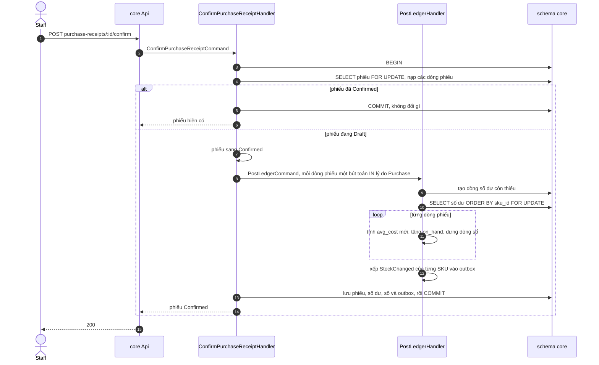

# Luồng: nhập hàng và tính giá vốn

Xác nhận phiếu nhập là một transaction: khóa phiếu, khóa số dư, tính lại giá vốn bình quân, tăng tồn và ghi sổ. Use case [UC-INV-02](../../usecase-userstory/inventory.md); API `POST /api/core/purchase-receipts/:id/confirm`; quyết định [ADR-0004](../../decisions/0004-wac-per-branch.md).



`PostLedgerHandler` là cửa duy nhất đổi `on_hand`: nó tự khóa số dư, tính giá vốn trong `InventoryBalance.Post` và xếp `StockChanged` vào outbox. Mọi thay đổi được ghi xuống database trong một lần lưu ngay trước `COMMIT`; lỗi ở bất kỳ đâu trước đó thì không gì được ghi.

## Công thức

```math
\text{avg\_cost mới} = \frac{\text{on\_hand} \times \text{avg\_cost} + \text{SL nhập} \times \text{đơn giá nhập}}{\text{on\_hand} + \text{SL nhập}}
```

`on_hand` và `avg_cost` là giá trị đọc được sau khi đã khóa dòng số dư. Ví dụ: tồn 10 giá vốn 100.000, nhập 5 giá 130.000, giá vốn mới là 110.000 và tồn là 15.

## Mỗi bước đổi gì

| Bước | Khóa | Số dư | Sổ | Outbox |
| --- | --- | --- | --- | --- |
| Khóa phiếu | Dòng `purchase_receipts` | | | |
| Khóa số dư | Các dòng `inventory_balances` của phiếu, theo `sku_id` | | | |
| Mỗi dòng phiếu | | `on_hand` tăng, `avg_cost` mới, `version` tăng | Một dòng IN, `reason = Purchase`, `unit_cost` là đơn giá nhập, `balance_after` là `on_hand` mới | |
| Kết thúc | | | | `StockChanged` cho từng SKU |

## Trường hợp biên

- Phiếu đã Confirmed: trả phiếu hiện có, không tác động lần hai.
- SKU chưa có dòng số dư ở chi nhánh: dòng được tạo với tồn 0 trước khi khóa; giá vốn mới bằng đúng đơn giá nhập.
- Cùng một SKU xuất hiện ở hai dòng phiếu: xử lý lần lượt, dòng sau dùng kết quả của dòng trước.
- SKU không có trong `sku_refs` hoặc chi nhánh đã tắt: từ chối ngay khi tạo phiếu Draft, không đợi tới lúc xác nhận.
- Lỗi ở bất kỳ dòng nào: rollback toàn bộ; phiếu vẫn ở Draft.
- Hai lời gọi xác nhận tới cùng lúc: lời gọi sau chờ ở khóa dòng phiếu, rồi thấy phiếu đã Confirmed và trả phiếu hiện có.
- Dòng sổ ghi `created_by` là người xác nhận phiếu.

## Kiểm thử

T09 (giá vốn 110.000), T11 (xác nhận lại không đổi gì), T16 (sổ không sửa được).
