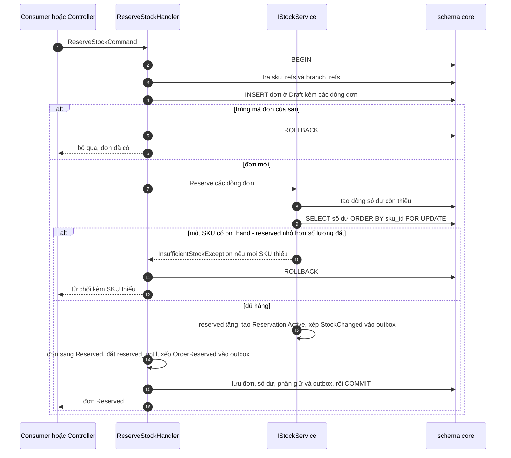

# Luồng: giữ hàng

Tạo đơn và giữ hàng là một transaction: chèn đơn, khóa số dư, kiểm tồn khả dụng của mọi SKU, rồi tăng `reserved`. Thiếu một SKU thì cả đơn bị từ chối. Use case [UC-ORD-01](../../usecase-userstory/orders.md) và UC-ORD-02; trạng thái ở [state-machines.md](../state-machines.md).

Luồng có hai đường vào dùng chung một handler: consumer `SubmitOrder` cho đơn online và `POST /api/core/orders` cho đơn thủ công.

Đơn được chèn xuống database trước khi khóa số dư, để chỉ mục unique chặn đơn trùng trước khi nó kịp giữ thêm hàng và để chứng từ đứng trước số dư trong thứ tự khóa. `IStockService` kiểm mọi SKU dưới khóa trước khi đổi bất kỳ số dư nào, nên khi thiếu hàng không dòng nào bị giữ.

## Mỗi bước đổi gì

| Bước | Khóa | Số dư | Sổ | Outbox |
| --- | --- | --- | --- | --- |
| Chèn đơn | Unique `(tenant_id, channel, external_order_id)` chặn trùng | | | |
| Khóa số dư | Các dòng `inventory_balances` của đơn, theo `sku_id` | | | |
| Giữ hàng | | `reserved` tăng, `version` tăng | Không ghi, vì `on_hand` không đổi | |
| Kết thúc | | | | `OrderReserved`, `StockChanged` |

## Sau khi bị từ chối

Transaction đã rollback nên không có đơn nào được lưu. Việc báo kết quả tùy đường vào:

| Đường vào | Kết quả |
| --- | --- |
| Consumer `SubmitOrder` | Sau khi rollback, mở transaction thứ hai chỉ để ghi outbox `OrderRejected`; dòng inbox và `OrderRejected` được commit cùng nhau, rồi thông điệp được xác nhận |
| `POST /api/core/orders` | Trả 409 `insufficient_stock` kèm từng SKU thiếu và tồn khả dụng hiện tại |

Trong consumer, phần chung đã mở transaction và ghi inbox trước khi gọi handler ([messaging.md](../../architecture/messaging.md)). Khi đó mỗi transaction của handler là một savepoint bên trong transaction ấy: rollback là quay về savepoint, bỏ đơn vừa chèn và nhả khóa số dư, còn dòng inbox ở lại. Gọi handler ngoài consumer thì hai transaction là hai transaction thật.

## Trường hợp biên

- 50 request cùng mua đơn vị cuối: các request xếp hàng ở bước khóa số dư; request đầu giữ được, 49 request sau đọc thấy tồn khả dụng bằng 0 và bị từ chối.
- SKU chưa có dòng số dư ở chi nhánh: coi như tồn khả dụng bằng 0.
- `skuCode` không có trong `sku_refs`, SKU ngừng bán, chi nhánh đã tắt: từ chối với lý do `UnknownSku`, `InactiveSku`, `InactiveBranch`. Với đơn thủ công, SKU hoặc chi nhánh chưa tới do event trễ trả 409 `reference_not_ready`; chi nhánh đã tắt hoặc SKU ngừng bán trả 409 `inactive_reference`.
- Đơn online trỏ tới chi nhánh chưa có bản sao ở `core`: từ chối với lý do `InactiveBranch`, vì consumer không có ai để trả 409 cho thử lại.
- `details` của `OrderRejected`: với `InsufficientStock` nêu từng SKU thiếu kèm số đặt và tồn khả dụng đọc dưới khóa; với `UnknownSku` và `InactiveSku` nêu mã SKU, số đặt và `available` bằng 0; với `InactiveBranch` để rỗng.
- Cùng mã đơn của sàn tới lần hai: lần chèn đơn vấp chỉ mục unique, transaction rollback và không thông điệp nào được phát thêm.
- Một SKU xuất hiện ở hai dòng đơn: cộng số lượng lại trước khi kiểm.
- Thời hạn giữ hàng là 30 phút, lấy từ cấu hình `Reservation:HoldMinutes`.

## Kiểm thử

T01 (50 request, 1 sản phẩm), T03 (đơn trùng), T04 (đơn nhiều SKU thiếu một).
