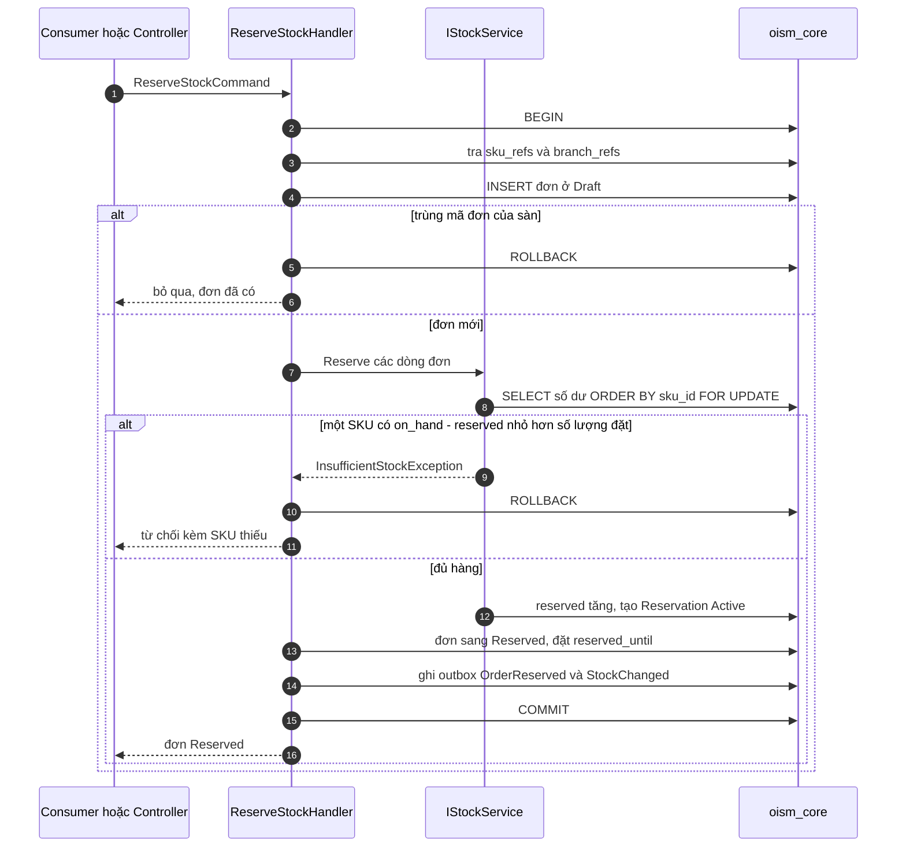

# Luồng: giữ hàng

Tạo đơn và giữ hàng là một transaction: chèn đơn, khóa số dư, kiểm tồn khả dụng của mọi SKU, rồi tăng `reserved`. Thiếu một SKU thì cả đơn bị từ chối. Use case [UC-ORD-01](../../usecase-userstory/orders.md) và UC-ORD-02; trạng thái ở [state-machines.md](../state-machines.md).

Luồng có hai đường vào dùng chung một handler: consumer `SubmitOrder` cho đơn online và `POST /api/core/orders` cho đơn thủ công.

## Mỗi bước đổi gì

| Bước | Khóa | Số dư | Sổ | Outbox |
| --- | --- | --- | --- | --- |
| Chèn đơn | Unique `(tenant_id, channel, external_order_id)` chặn trùng | | | |
| Khóa số dư | Các dòng `inventory_balances` của đơn, theo `sku_id` | | | |
| Giữ hàng | | `reserved` tăng, `version` tăng | Không ghi, vì `on_hand` không đổi | |
| Kết thúc | | | | `OrderReserved`, `StockChanged` |

## Sau khi bị từ chối

Transaction đã rollback nên không có đơn nào được lưu. Việc báo kết quả tùy đường vào:

| Đường vào | Kết quả |
| --- | --- |
| Consumer `SubmitOrder` | Sau khi rollback, mở transaction thứ hai chỉ để ghi inbox và outbox `OrderRejected`, rồi xác nhận thông điệp |
| `POST /api/core/orders` | Trả 409 `insufficient_stock` kèm từng SKU thiếu và tồn khả dụng hiện tại |

## Trường hợp biên

- 50 request cùng mua đơn vị cuối: các request xếp hàng ở bước khóa số dư; request đầu giữ được, 49 request sau đọc thấy tồn khả dụng bằng 0 và bị từ chối.
- SKU chưa có dòng số dư ở chi nhánh: coi như tồn khả dụng bằng 0.
- `skuCode` không có trong `sku_refs`, SKU ngừng bán, chi nhánh đã tắt: từ chối với lý do `UnknownSku`, `InactiveSku`, `InactiveBranch`. Với đơn thủ công, SKU chưa tới do event trễ trả 409 `reference_not_ready`.
- Một SKU xuất hiện ở hai dòng đơn: cộng số lượng lại trước khi kiểm.
- Thời hạn giữ hàng là 30 phút, lấy từ cấu hình `Reservation:HoldMinutes`.

## Kiểm thử

T01 (50 request, 1 sản phẩm), T03 (đơn trùng), T04 (đơn nhiều SKU thiếu một).
