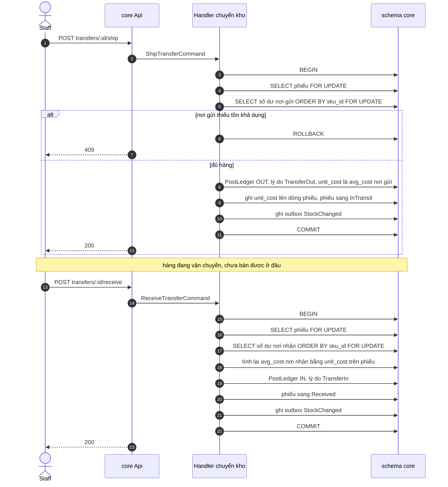

# Luồng: chuyển kho

Chuyển kho gồm hai transaction cách nhau bằng thời gian vận chuyển: xuất ở nơi gửi và nhận ở nơi nhận. Giữa hai bước, hàng không thuộc tồn của chi nhánh nào mà nằm trên phiếu ở trạng thái InTransit. Use case [UC-INV-03](../../usecase-userstory/inventory.md); quyết định [ADR-0009](../../decisions/0009-transfer-and-stocktake.md).

## Mỗi bước đổi gì

| Bước | Khóa | Số dư | Sổ |
| --- | --- | --- | --- |
| Xuất | Phiếu, rồi số dư nơi gửi | `on_hand` nơi gửi giảm; `avg_cost` nơi gửi không đổi | OUT, `reason = TransferOut`, `unit_cost` là `avg_cost` nơi gửi |
| Nhận | Phiếu, rồi số dư nơi nhận | `on_hand` nơi nhận tăng; `avg_cost` nơi nhận tính lại | IN, `reason = TransferIn`, `unit_cost` lấy từ dòng phiếu |

Cả hai dòng sổ có `reference_type = StockTransfer` và cùng `reference_id`, nên đối soát được hai đầu.

## Bất biến

Tại mọi thời điểm, với mỗi SKU: tồn nơi gửi cộng số lượng trên các phiếu InTransit cộng tồn nơi nhận không đổi do chuyển kho.

## Trường hợp biên

- Kiểm khi xuất dùng tồn khả dụng, không dùng `on_hand`: hàng đang giữ cho đơn không được chuyển đi.
- Nhận lại phiếu đã Received: không tác động lần hai.
- Nhận phiếu còn Draft: trả 409.
- Phiếu Draft xóa được; phiếu InTransit không hủy được.
- Nơi nhận chưa có dòng số dư cho SKU: tạo dòng trước khi khóa; giá vốn nơi nhận bằng `unit_cost` trên phiếu.
- Nhận đủ số lượng đã xuất. Hàng thiếu hoặc hỏng xử lý bằng một phiên kiểm kê ở nơi nhận.

## Kiểm thử

T12 (chưa nhận thì tồn khả dụng nơi nhận chưa tăng).
