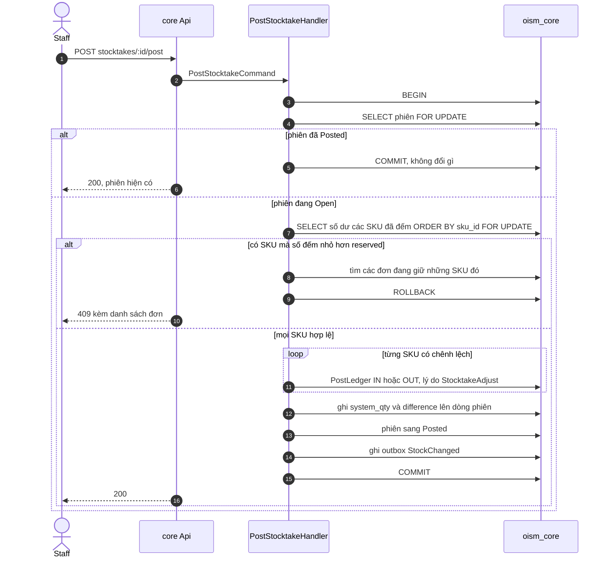

# Luồng: kiểm kê

Nhập số đếm không tác động tồn; chỉ bước chốt mới ghi sổ. Chốt là một transaction cho cả phiên: hoặc mọi SKU được điều chỉnh, hoặc không SKU nào. Use case [UC-INV-04](../../usecase-userstory/inventory.md); quyết định [ADR-0009](../../decisions/0009-transfer-and-stocktake.md).

## Mỗi bước đổi gì

| Bước | Khóa | Số dư | Sổ |
| --- | --- | --- | --- |
| Khóa phiên | Dòng `stocktakes` | | |
| Khóa số dư | Các dòng `inventory_balances` của SKU đã đếm, theo `sku_id` | | |
| SKU đếm nhiều hơn sổ | | `on_hand` tăng tới số đếm | IN, `reason = StocktakeAdjust`, số lượng là phần chênh |
| SKU đếm ít hơn sổ | | `on_hand` giảm tới số đếm | OUT, `reason = StocktakeAdjust`, số lượng là phần chênh |
| SKU đếm bằng sổ | | Không đổi | Không ghi |

`avg_cost` không đổi qua kiểm kê. `unit_cost` của dòng sổ điều chỉnh là `avg_cost` hiện tại.

## Vì sao chặn khi số đếm nhỏ hơn reserved

Nếu `reserved = 8` mà đếm được 6, đặt `on_hand = 6` sẽ làm tồn khả dụng thành âm 2 và vi phạm CHECK. Hệ thống không tự chọn đơn nào bị hủy. Nó trả danh sách đơn đang giữ SKU đó để nhân viên hủy hoặc xử lý, rồi chốt lại.

## Trường hợp biên

- `system_qty` là `on_hand` đọc được lúc chốt, dưới khóa, không phải lúc mở phiên. Bán hàng xảy ra giữa lúc đếm và lúc chốt vì thế được tính vào.
- SKU không được đếm thì không bị đụng tới.
- SKU chưa có dòng số dư mà được đếm lớn hơn 0: tạo dòng với tồn 0 rồi điều chỉnh tăng; giá vốn bằng 0 cho tới lần nhập mua đầu tiên.
- Chốt lại phiên đã Posted: không tác động lần hai.

## Kiểm thử

T13 (số đếm thấp hơn lượng đã giữ bị chặn).
