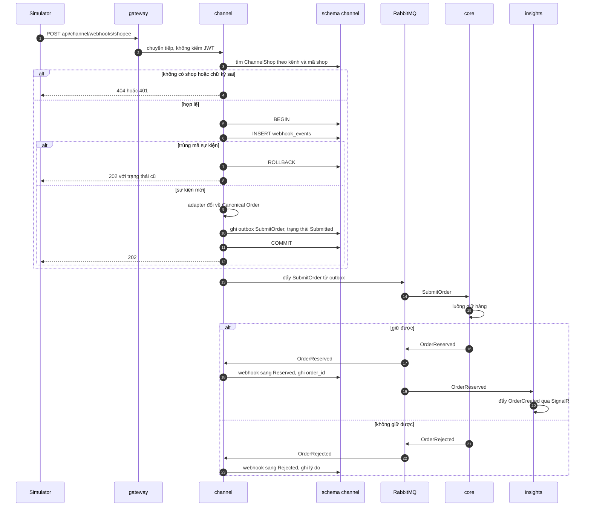

# Luồng: nhận webhook

`channel` nhận webhook, kiểm chữ ký, chống trùng, đổi payload của từng kênh về Canonical Order rồi gửi command `SubmitOrder` cho `core`. Webhook được trả lời ngay bằng 202; kết quả giữ hàng về sau bằng event. Use case [UC-SIM-01](../../usecase-userstory/channel-realtime.md) và [UC-ORD-01](../../usecase-userstory/orders.md); payload ở [api/channel.md](../api/channel.md).

## Ba hàng rào chống trùng

| Lớp | Hàng rào | Chặn được |
| --- | --- | --- |
| `channel` | Unique `(tenant_id, channel, event_id)` | Sàn gửi lại cùng webhook |
| `core` inbox | `eventId` của `SubmitOrder` | RabbitMQ giao lại cùng thông điệp |
| `core` đơn | Unique `(tenant_id, channel, external_order_id)` | Hai webhook khác mã sự kiện nhưng cùng một đơn |

## Trường hợp biên

- Payload không đổi được về Canonical Order (thiếu trường, sai kiểu): lưu bản ghi với trạng thái Failed kèm lý do, trả 202, không phát command. Webhook không được trả lỗi 5xx vì payload xấu, để sàn không gửi lại mãi.
- Shop bị tắt: coi như không có shop, trả 404.
- `skuCode` không có ở `core`: `core` phát `OrderRejected` với lý do `UnknownSku`.
- Tenant context: webhook không có JWT. `channel` đặt tenant context theo `ChannelShop` tìm được; command mang `tenantId` đó.
- Bắn tải: `POST /api/channel/simulator/burst` tự sinh và tự gửi các webhook song song vào chính endpoint webhook, mỗi webhook một mã sự kiện và một mã đơn khác nhau.

## Vì sao tách khỏi core

Webhook tới theo đợt dồn dập. `channel` chỉ ghi một dòng và một thông điệp cho mỗi webhook rồi trả lời ngay; hàng đợi đệm phần còn lại. `core` xử lý `SubmitOrder` theo nhịp của mình mà không làm chậm POS và nhân viên đang dùng API của nó.

## Kiểm thử

T01 (bắn 50 đơn vào 1 sản phẩm), T03 (gửi lại cùng webhook), T22 (thông điệp giao lại không xử lý trùng).
