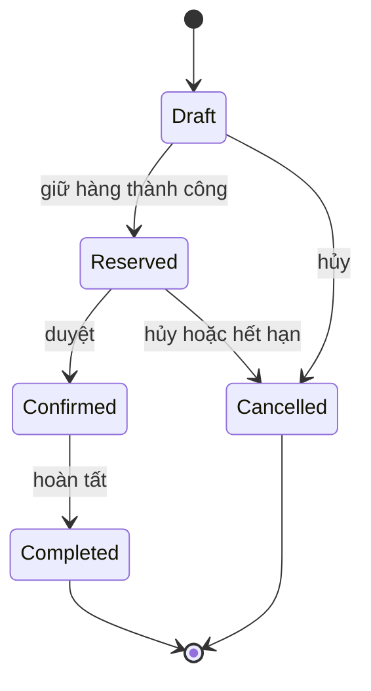
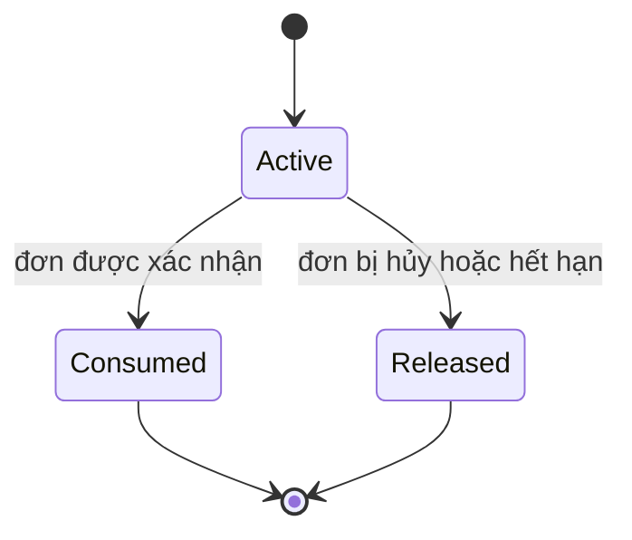
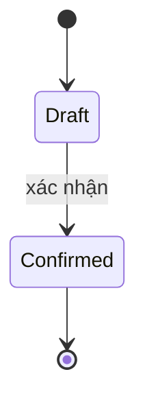
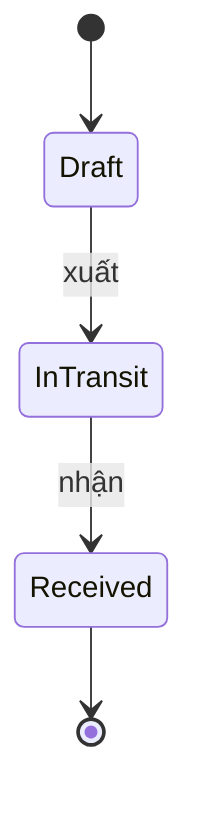
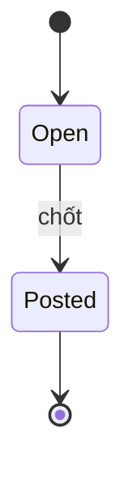
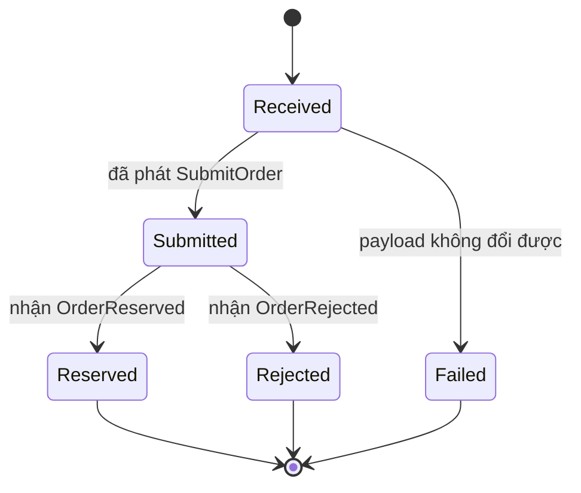

# Máy trạng thái

Sáu đối tượng có trạng thái. Mọi bước chuyển không có trong bảng đều bị từ chối bằng lỗi 409 mã `invalid_state_transition`. Quy tắc chuyển nằm ở Domain, không nằm ở controller hay ở giao diện.

## Đơn hàng

| Từ | Sang | Kích hoạt | Điều kiện | Tác động trong cùng transaction |
| --- | --- | --- | --- | --- |
| Draft | Reserved | Tiếp nhận đơn online, tạo đơn thủ công, POS checkout | Mọi SKU đủ tồn khả dụng | `reserved` tăng; tạo phần giữ hàng Active; phát `OrderReserved`, `StockChanged` |
| Reserved | Confirmed | Nhân viên duyệt; POS checkout | Đơn đang Reserved | `on_hand` và `reserved` giảm; chốt `cost_price`; ghi ledger OUT; phần giữ sang Consumed; phát `OrderConfirmed`, `StockChanged` |
| Confirmed | Completed | Nhân viên hoàn tất; POS checkout | Đơn đang Confirmed | Không tác động tồn |
| Draft | Cancelled | Hủy | | Không tác động tồn |
| Reserved | Cancelled | Nhân viên hủy; job hết hạn | Đơn đang Reserved | `reserved` giảm; phần giữ sang Released; phát `OrderCancelled`, `StockChanged` |

Ghi chú:

- Trong các luồng hiện có, Draft chỉ tồn tại bên trong transaction tạo đơn. Giữ hàng thất bại thì transaction rollback và đơn không được lưu; đơn online bị từ chối được ghi nhận ở `webhook_events` của `channel`.
- POS checkout đi qua Reserved, Confirmed rồi Completed trong một transaction. Với đơn POS, `OrderReserved` không được phát; chỉ có `OrderConfirmed` và `StockChanged`.
- Không có bước nào rời Confirmed hay Completed ngoài bước hoàn tất ([ADR-0005](../decisions/0005-order-lifecycle-and-transactions.md)).

## Phần giữ hàng

Tổng số lượng của các phần giữ Active của một SKU tại một chi nhánh luôn bằng `reserved` trên dòng số dư. Hai giá trị này chỉ đổi cùng nhau qua `IStockService`.

## Phiếu nhập

| Từ | Sang | Tác động |
| --- | --- | --- |
| Draft | Confirmed | `on_hand` tăng; tính lại `avg_cost`; ghi ledger IN lý do Purchase; phát `StockChanged` |

Phiếu Draft sửa được, kể cả đổi và xóa dòng; không có thao tác xóa cả phiếu. Phiếu Confirmed không sửa được; nhập sai thì điều chỉnh bằng kiểm kê.

## Phiếu chuyển kho

| Từ | Sang | Điều kiện | Tác động |
| --- | --- | --- | --- |
| Draft | InTransit | Nơi gửi đủ tồn khả dụng | `on_hand` nơi gửi giảm; ghi ledger OUT lý do TransferOut; ghi `unit_cost` lên dòng phiếu |
| InTransit | Received | | `on_hand` nơi nhận tăng; tính lại `avg_cost` nơi nhận; ghi ledger IN lý do TransferIn |

## Phiên kiểm kê

| Từ | Sang | Điều kiện | Tác động |
| --- | --- | --- | --- |
| Open | Posted | Không SKU nào có số đếm nhỏ hơn `reserved` | Ghi ledger điều chỉnh cho từng SKU có chênh lệch; `on_hand` bằng số đếm |

## Bản ghi webhook

Trong luồng bình thường, bản ghi được lưu và `SubmitOrder` được ghi vào outbox trong cùng một transaction, nên bản ghi tới thẳng Submitted. Received chỉ quan sát được khi payload lỗi và chuyển sang Failed.
