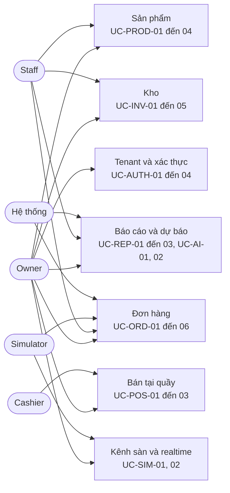

# Use case và user story

Thư mục này ghi ai làm gì với OISM và thế nào thì được coi là đạt. Có 29 use case; mỗi use case có một user story và các tiêu chí chấp nhận đánh số. Tiêu chí chấp nhận là đích của code và là nguồn để viết test.

## Actor

| Actor | Là ai | Dùng gì |
| --- | --- | --- |
| Owner | Chủ cửa hàng, toàn quyền trong tenant | Admin, POS |
| Staff | Nhân viên quản lý kho và đơn hàng | Admin |
| Cashier | Thu ngân, gắn với một chi nhánh | POS |
| Simulator | Công cụ giả lập sàn Shopee, TikTok, Lazada | Webhook |
| Hệ thống | Job nền Hangfire | Không có giao diện |

## Bản đồ



## Danh mục

| Mã | Use case | Actor | Yêu cầu | File |
| --- | --- | --- | --- | --- |
| UC-AUTH-01 | Đăng ký tenant | Người đăng ký | FR-AUTH-01 | [auth.md](auth.md) |
| UC-AUTH-02 | Đăng nhập, làm mới phiên, đăng xuất | Mọi vai trò | FR-AUTH-02 | [auth.md](auth.md) |
| UC-AUTH-03 | Quản lý người dùng và vai trò | Owner | FR-AUTH-03 | [auth.md](auth.md) |
| UC-AUTH-04 | Quản lý chi nhánh | Owner | FR-AUTH-04 | [auth.md](auth.md) |
| UC-PROD-01 | Quản lý danh mục và thương hiệu | Owner, Staff | FR-PROD-01 | [catalog.md](catalog.md) |
| UC-PROD-02 | Quản lý sản phẩm và SKU | Owner, Staff | FR-PROD-02 | [catalog.md](catalog.md) |
| UC-PROD-03 | Quản lý mã vạch | Owner, Staff | FR-PROD-03 | [catalog.md](catalog.md) |
| UC-PROD-04 | Đặt giá lẻ, giá sỉ | Owner | FR-PROD-04 | [catalog.md](catalog.md) |
| UC-INV-01 | Xem tồn và sổ giao dịch | Owner, Staff | FR-INV-01, FR-RSE-01 | [inventory.md](inventory.md) |
| UC-INV-02 | Nhập hàng từ nhà cung cấp | Owner, Staff | FR-INV-02, FR-COST-01 | [inventory.md](inventory.md) |
| UC-INV-03 | Chuyển kho giữa hai chi nhánh | Owner, Staff | FR-INV-03 | [inventory.md](inventory.md) |
| UC-INV-04 | Kiểm kê | Owner, Staff | FR-INV-04 | [inventory.md](inventory.md) |
| UC-INV-05 | Đặt ngưỡng tồn tối thiểu | Owner, Staff | FR-REP-03 | [inventory.md](inventory.md) |
| UC-ORD-01 | Tiếp nhận đơn online và giữ hàng | Simulator | FR-ORD-01, FR-RSE-02 | [orders.md](orders.md) |
| UC-ORD-02 | Tạo đơn thủ công | Owner, Staff | FR-ORD-01, FR-RSE-02 | [orders.md](orders.md) |
| UC-ORD-03 | Duyệt đơn | Owner, Staff | FR-ORD-03, FR-RSE-03, FR-COST-02 | [orders.md](orders.md) |
| UC-ORD-04 | Hủy đơn | Owner, Staff | FR-ORD-03, FR-RSE-03 | [orders.md](orders.md) |
| UC-ORD-05 | Tự hủy đơn giữ hàng hết hạn | Hệ thống | FR-SIM-03, FR-RSE-03 | [orders.md](orders.md) |
| UC-ORD-06 | Hoàn tất đơn và in phiếu giao | Owner, Staff | FR-ORD-02, FR-ORD-03 | [orders.md](orders.md) |
| UC-POS-01 | Tìm hoặc quét sản phẩm | Cashier, Owner | FR-POS-01, FR-POS-02 | [pos.md](pos.md) |
| UC-POS-02 | Thanh toán tại quầy | Cashier, Owner | FR-POS-03, FR-POS-04, FR-COST-02 | [pos.md](pos.md) |
| UC-POS-03 | In hóa đơn | Cashier, Owner | FR-POS-03 | [pos.md](pos.md) |
| UC-REP-01 | Xem doanh thu và lợi nhuận gộp | Owner | FR-REP-01, FR-SIM-03 | [reports.md](reports.md) |
| UC-REP-02 | Xem giá trị tồn, hàng bán chạy, bán chậm | Owner, Staff | FR-REP-02 | [reports.md](reports.md) |
| UC-REP-03 | Nhận cảnh báo tồn thấp | Owner, Staff | FR-REP-03 | [reports.md](reports.md) |
| UC-AI-01 | Xem đề xuất nhập hàng | Owner | FR-AI-01, FR-AI-02 | [reports.md](reports.md) |
| UC-AI-02 | Chạy và đánh giá dự báo | Owner, Hệ thống | FR-AI-01, FR-AI-03 | [reports.md](reports.md) |
| UC-SIM-01 | Bắn webhook giả lập | Owner | FR-SIM-01 | [channel-realtime.md](channel-realtime.md) |
| UC-SIM-02 | Nhận thông báo đơn mới theo thời gian thực | Mọi vai trò | FR-SIM-02 | [channel-realtime.md](channel-realtime.md) |

## Khuôn của một use case

```markdown
## UC-XXX-NN Tên use case

- Actor: ...
- Yêu cầu: FR-..., NFR-...
- API: ...
- Thiết kế: link tới luồng hoặc data model

Là <vai trò>, tôi muốn <việc>, để <lợi ích>.

Tiêu chí chấp nhận:

1. Cho <trạng thái đầu>, khi <hành động>, thì <kết quả kiểm được>.
```

## Quy ước

- Trích dẫn tiêu chí theo dạng `UC-ORD-03 AC-2`. Tên test nên mang mã đó.
- Mỗi tiêu chí phải kiểm được bằng test tự động hoặc bằng một thao tác demo. Câu như "hệ thống hoạt động ổn định" không phải tiêu chí.
- Thêm hành vi mới thì thêm tiêu chí trước, viết code sau.
- Lỗi nghiệp vụ dùng mã HTTP: 400 dữ liệu vào sai, 401 chưa đăng nhập, 403 thiếu quyền, 404 không có hoặc thuộc tenant khác, 409 trái trạng thái hoặc thiếu hàng.
